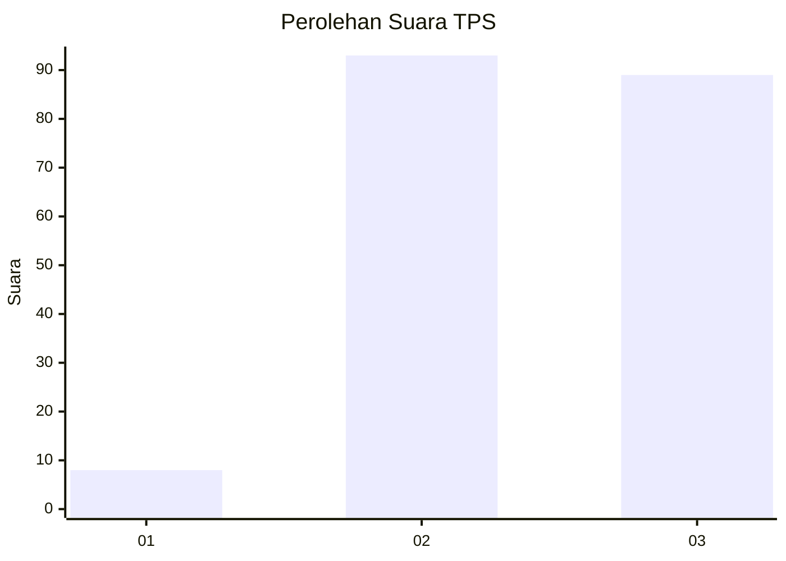
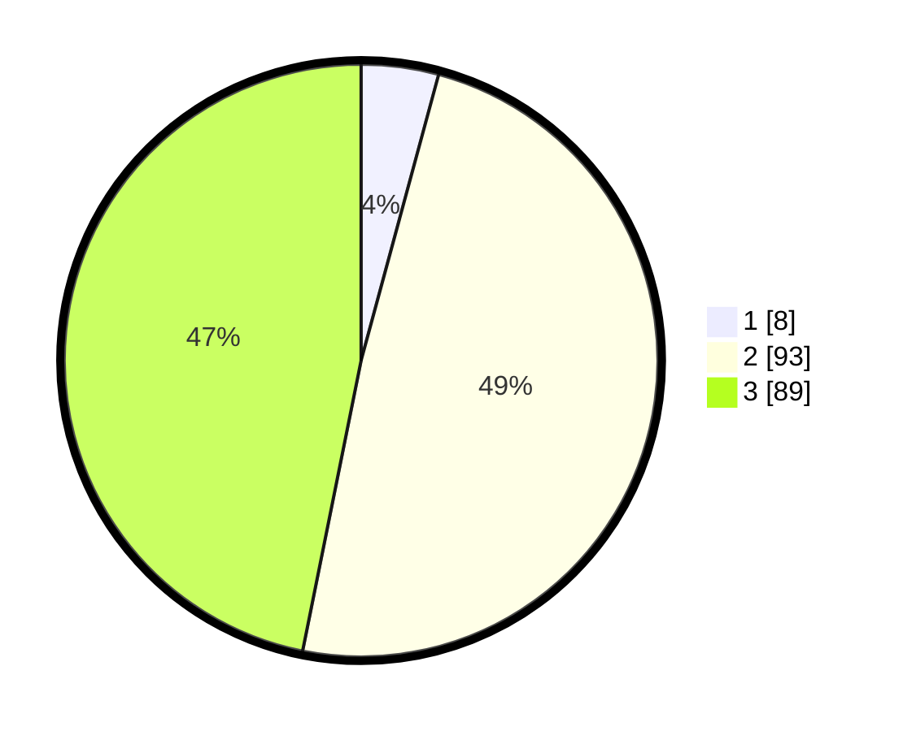

# Hasil

## Grafik

## Tabel

| No. | Nama Paslon    | Suara | Suara (raw) | Persentase |
|:--- |:-------------- | -----:| -----------:| ----------:|
| 1   | ANIES MUHAIMIN | 8     | [8][p-1]    | 4,21       |
| 2   | PRABOWO GIBRAN | 93    | [93][p-2]   | 48,95      |
| 3   | GANJAR MAHFUD  | 89    | [89][p-3]   | 46,84      |

[p-1]: https://github.com/gigit-pemilu/pemilu-2024-51-bali/blob/main/pilpres/hitung-suara/sub/51-bali/sub/71-kota-denpasar/sub/04-denpasar-utara/sub/2003-dangin-puri-kaja/sub/006-tps/sub/paslon-1.txt
[p-2]: https://github.com/gigit-pemilu/pemilu-2024-51-bali/blob/main/pilpres/hitung-suara/sub/51-bali/sub/71-kota-denpasar/sub/04-denpasar-utara/sub/2003-dangin-puri-kaja/sub/006-tps/sub/paslon-2.txt
[p-3]: https://github.com/gigit-pemilu/pemilu-2024-51-bali/blob/main/pilpres/hitung-suara/sub/51-bali/sub/71-kota-denpasar/sub/04-denpasar-utara/sub/2003-dangin-puri-kaja/sub/006-tps/sub/paslon-3.txt

## Foto C Plano

https://sirekap-obj-formc.kpu.go.id/b1be/pemilu/ppwp/51/71/04/20/03/5171042003006-20240215-011334--4ed1c5d7-da2c-4dff-991b-94474b1f4b48.jpg

https://sirekap-obj-formc.kpu.go.id/b1be/pemilu/ppwp/51/71/04/20/03/5171042003006-20240215-011431--e5bd1124-3199-47ab-a0e4-a525b5aecc86.jpg

https://sirekap-obj-formc.kpu.go.id/b1be/pemilu/ppwp/51/71/04/20/03/5171042003006-20240215-011608--8f584c4b-2f1a-4984-9f2a-ecba2ffa2f39.jpg

## Metadata

| Key        | Value               |
| ---------- | ------------------- |
| Time Stamp | 2024-02-24 22:31:28 |

