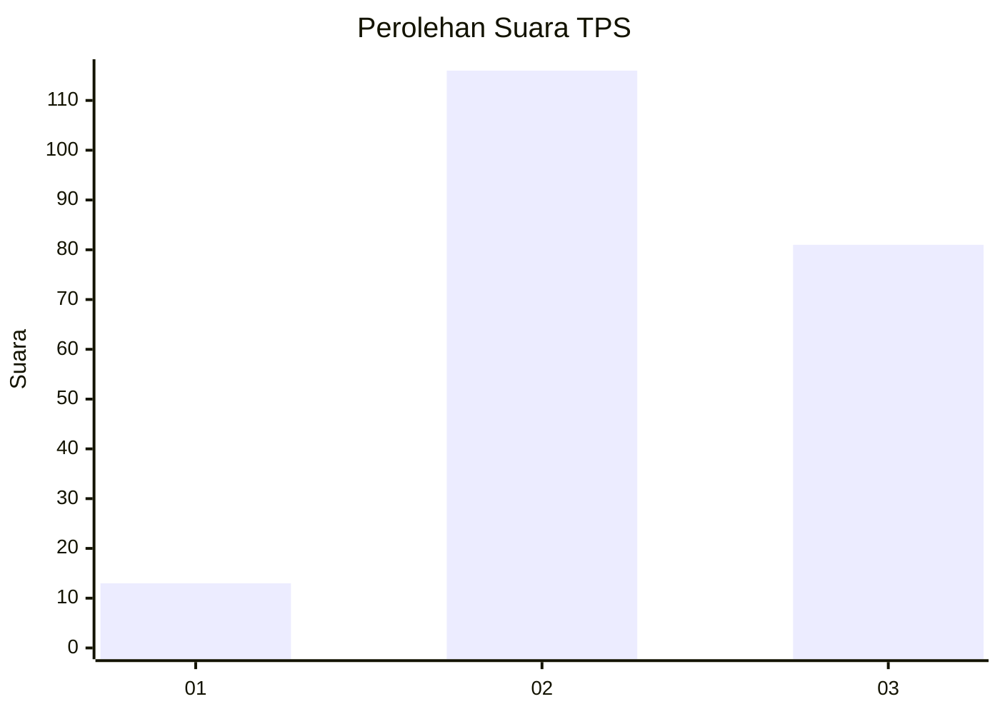
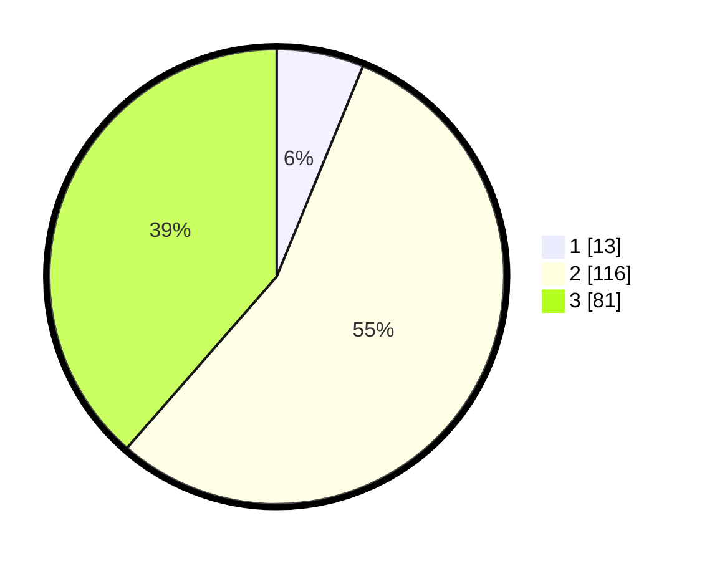

# Hasil

## Grafik

## Tabel

| No. | Nama Paslon    | Suara | Suara (raw) | Persentase |
|:--- |:-------------- | -----:| -----------:| ----------:|
| 1   | ANIES MUHAIMIN | 13    | [13][p-1]   | 6,19       |
| 2   | PRABOWO GIBRAN | 116   | [116][p-2]  | 55,24      |
| 3   | GANJAR MAHFUD  | 81    | [81][p-3]   | 38,57      |

[p-1]: https://github.com/gigit-pemilu/pemilu-2024-51-bali/blob/main/pilpres/hitung-suara/sub/51-bali/sub/71-kota-denpasar/sub/04-denpasar-utara/sub/2003-dangin-puri-kaja/sub/008-tps/sub/paslon-1.txt
[p-2]: https://github.com/gigit-pemilu/pemilu-2024-51-bali/blob/main/pilpres/hitung-suara/sub/51-bali/sub/71-kota-denpasar/sub/04-denpasar-utara/sub/2003-dangin-puri-kaja/sub/008-tps/sub/paslon-2.txt
[p-3]: https://github.com/gigit-pemilu/pemilu-2024-51-bali/blob/main/pilpres/hitung-suara/sub/51-bali/sub/71-kota-denpasar/sub/04-denpasar-utara/sub/2003-dangin-puri-kaja/sub/008-tps/sub/paslon-3.txt

## Foto C Plano

https://sirekap-obj-formc.kpu.go.id/b3df/pemilu/ppwp/51/71/04/20/03/5171042003008-20240215-032630--9c2a74ea-ba8f-44bc-8a5e-aeb428af5758.jpg

https://sirekap-obj-formc.kpu.go.id/b3df/pemilu/ppwp/51/71/04/20/03/5171042003008-20240214-210807--d7ddeefb-8f68-471f-a000-17f4dd58fd9a.jpg

https://sirekap-obj-formc.kpu.go.id/b3df/pemilu/ppwp/51/71/04/20/03/5171042003008-20240214-211856--6429fda7-0c29-42b9-ac92-176b7aaa6c12.jpg

## Metadata

| Key        | Value               |
| ---------- | ------------------- |
| Time Stamp | 2024-02-16 14:00:34 |

