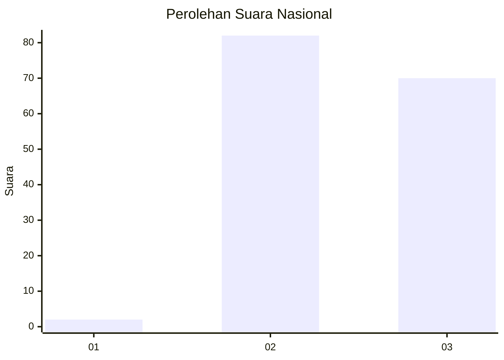
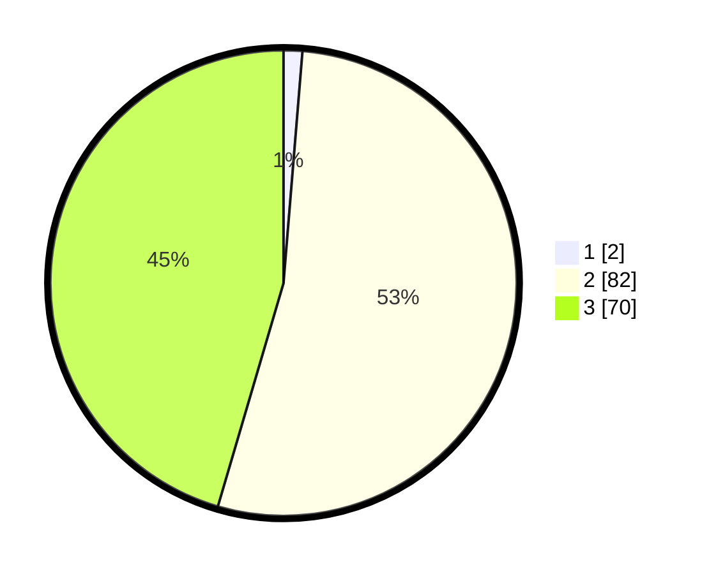

# Hasil

## Grafik

## Tabel

| No. | Nama Paslon    | Suara | Suara (raw) | Persentase |
|:--- |:-------------- | -----:| -----------:| ----------:|
| 1   | ANIES MUHAIMIN | 2     | [2][p-1]    | 1,30       |
| 2   | PRABOWO GIBRAN | 82    | [82][p-2]   | 53,25      |
| 3   | GANJAR MAHFUD  | 70    | [70][p-3]   | 45,45      |

[p-1]: https://github.com/gigit-pemilu/pemilu-2024/blob/main/pilpres/hitung-suara/sub/51-bali/sub/71-kota-denpasar/sub/04-denpasar-utara/sub/2003-dangin-puri-kaja/sub/011-tps/sub/paslon-1.txt
[p-2]: https://github.com/gigit-pemilu/pemilu-2024/blob/main/pilpres/hitung-suara/sub/51-bali/sub/71-kota-denpasar/sub/04-denpasar-utara/sub/2003-dangin-puri-kaja/sub/011-tps/sub/paslon-2.txt
[p-3]: https://github.com/gigit-pemilu/pemilu-2024/blob/main/pilpres/hitung-suara/sub/51-bali/sub/71-kota-denpasar/sub/04-denpasar-utara/sub/2003-dangin-puri-kaja/sub/011-tps/sub/paslon-3.txt

## Foto C Plano

https://sirekap-obj-formc.kpu.go.id/32b9/pemilu/ppwp/51/71/04/20/03/5171042003011-20240214-131554--d927803a-7926-4599-b036-440c70899397.jpg

https://sirekap-obj-formc.kpu.go.id/32b9/pemilu/ppwp/51/71/04/20/03/5171042003011-20240214-133418--4761e1f7-f786-4cfd-86e0-23c0017f8c5a.jpg

## Metadata

| Key        | Value               |
| ---------- | ------------------- |
| Time Stamp | 2024-02-24 22:31:28 |

