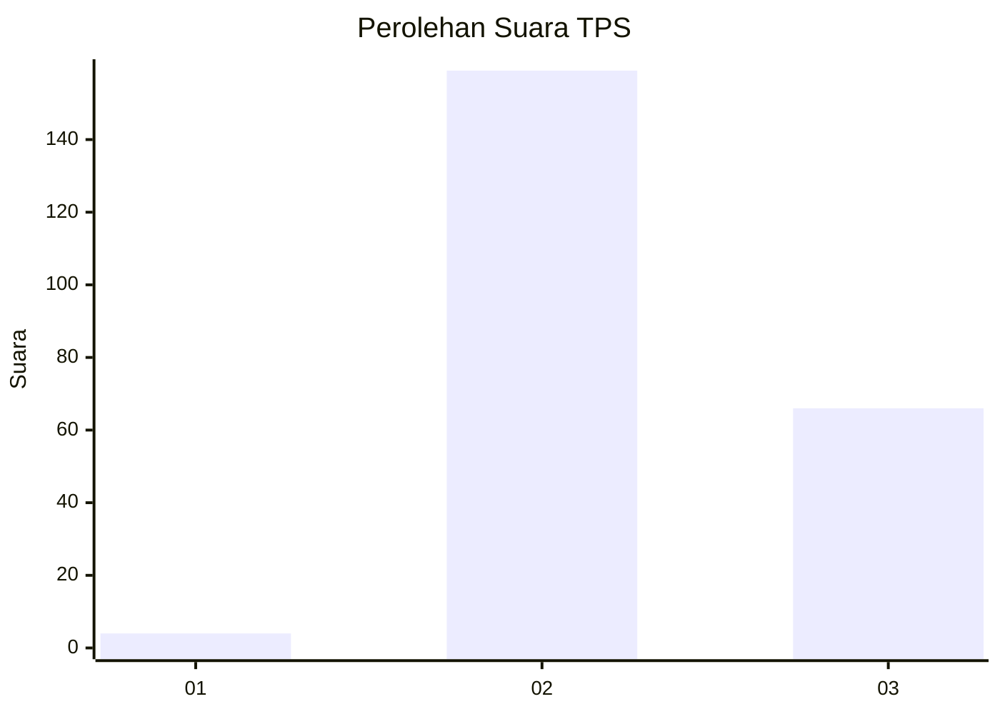

# Hasil

## Grafik

## Tabel

| No. | Nama Paslon    | Suara | Suara (raw) | Persentase |
|:--- |:-------------- | -----:| -----------:| ----------:|
| 1   | ANIES MUHAIMIN | 4     | [4][p-1]    | 1,75       |
| 2   | PRABOWO GIBRAN | 159   | [159][p-2]  | 69,43      |
| 3   | GANJAR MAHFUD  | 66    | [66][p-3]   | 28,82      |

[p-1]: https://github.com/gigit-pemilu/pemilu-2024-51-bali/blob/main/pilpres/hitung-suara/sub/51-bali/sub/71-kota-denpasar/sub/04-denpasar-utara/sub/2003-dangin-puri-kaja/sub/012-tps/sub/paslon-1.txt
[p-2]: https://github.com/gigit-pemilu/pemilu-2024-51-bali/blob/main/pilpres/hitung-suara/sub/51-bali/sub/71-kota-denpasar/sub/04-denpasar-utara/sub/2003-dangin-puri-kaja/sub/012-tps/sub/paslon-2.txt
[p-3]: https://github.com/gigit-pemilu/pemilu-2024-51-bali/blob/main/pilpres/hitung-suara/sub/51-bali/sub/71-kota-denpasar/sub/04-denpasar-utara/sub/2003-dangin-puri-kaja/sub/012-tps/sub/paslon-3.txt

## Foto C Plano

https://sirekap-obj-formc.kpu.go.id/cf25/pemilu/ppwp/51/71/04/20/03/5171042003012-20240214-213430--6099ee3c-5c47-4024-a01c-c7baa4b33ba2.jpg

https://sirekap-obj-formc.kpu.go.id/cf25/pemilu/ppwp/51/71/04/20/03/5171042003012-20240214-213532--17300253-a025-4b94-8854-440f539504cf.jpg

https://sirekap-obj-formc.kpu.go.id/cf25/pemilu/ppwp/51/71/04/20/03/5171042003012-20240214-213642--7eb55e70-5af5-4d1a-b7dc-58e087d31c8f.jpg

## Metadata

| Key        | Value               |
| ---------- | ------------------- |
| Time Stamp | 2024-02-24 22:31:28 |

