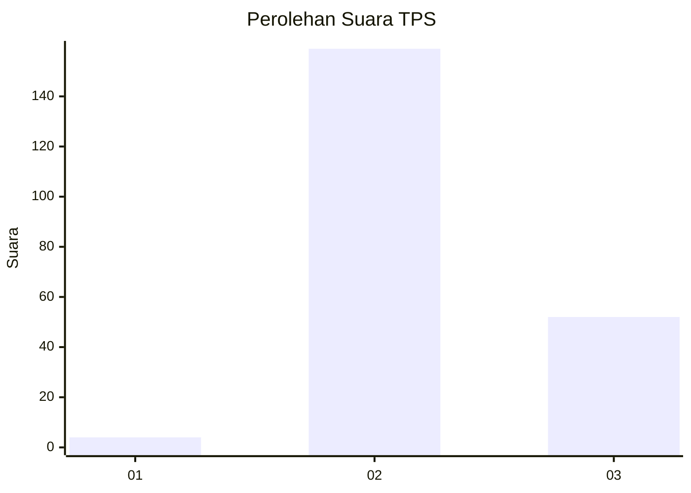
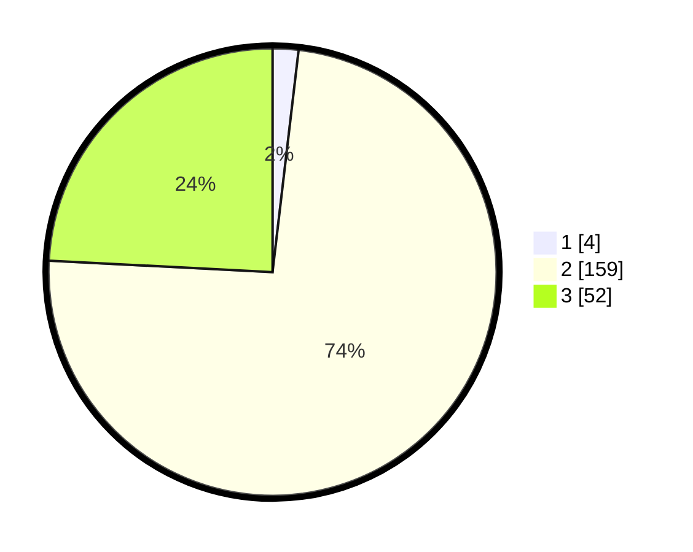

# Hasil

## Grafik

## Tabel

| No. | Nama Paslon    | Suara | Suara (raw) | Persentase |
|:--- |:-------------- | -----:| -----------:| ----------:|
| 1   | ANIES MUHAIMIN | 4     | [4][p-1]    | 1,86       |
| 2   | PRABOWO GIBRAN | 159   | [159][p-2]  | 73,95      |
| 3   | GANJAR MAHFUD  | 52    | [52][p-3]   | 24,19      |

[p-1]: https://github.com/gigit-pemilu/pemilu-2024-51-bali/blob/main/pilpres/hitung-suara/sub/51-bali/sub/71-kota-denpasar/sub/04-denpasar-utara/sub/2003-dangin-puri-kaja/sub/013-tps/sub/paslon-1.txt
[p-2]: https://github.com/gigit-pemilu/pemilu-2024-51-bali/blob/main/pilpres/hitung-suara/sub/51-bali/sub/71-kota-denpasar/sub/04-denpasar-utara/sub/2003-dangin-puri-kaja/sub/013-tps/sub/paslon-2.txt
[p-3]: https://github.com/gigit-pemilu/pemilu-2024-51-bali/blob/main/pilpres/hitung-suara/sub/51-bali/sub/71-kota-denpasar/sub/04-denpasar-utara/sub/2003-dangin-puri-kaja/sub/013-tps/sub/paslon-3.txt

## Foto C Plano

https://sirekap-obj-formc.kpu.go.id/eac1/pemilu/ppwp/51/71/04/20/03/5171042003013-20240214-220713--1987821b-464b-4f31-9452-1f816c40ed98.jpg

https://sirekap-obj-formc.kpu.go.id/eac1/pemilu/ppwp/51/71/04/20/03/5171042003013-20240214-220811--dfee9d60-9294-4775-a781-5aee35d1b801.jpg

https://sirekap-obj-formc.kpu.go.id/eac1/pemilu/ppwp/51/71/04/20/03/5171042003013-20240214-220900--40dd4045-cab7-4d1c-ab09-9b9ac3886571.jpg

## Metadata

| Key        | Value               |
| ---------- | ------------------- |
| Time Stamp | 2024-02-24 22:31:28 |

