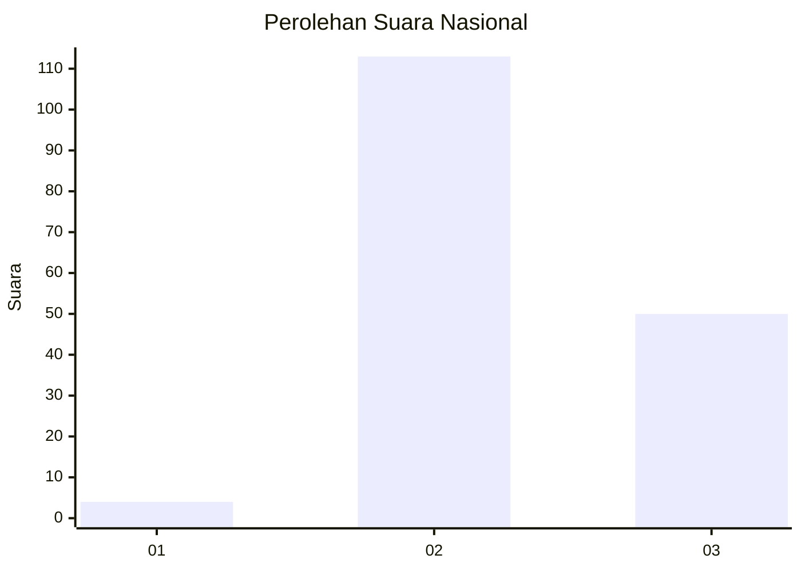

# Hasil

## Grafik

## Tabel

| No. | Nama Paslon    | Suara | Suara (raw) | Persentase |
|:--- |:-------------- | -----:| -----------:| ----------:|
| 1   | ANIES MUHAIMIN | 4     | [4][p-1]    | 2,40       |
| 2   | PRABOWO GIBRAN | 113   | [113][p-2]  | 67,66      |
| 3   | GANJAR MAHFUD  | 50    | [50][p-3]   | 29,94      |

[p-1]: https://github.com/gigit-pemilu/pemilu-2024/blob/main/pilpres/hitung-suara/sub/51-bali/sub/71-kota-denpasar/sub/04-denpasar-utara/sub/2003-dangin-puri-kaja/sub/020-tps/sub/paslon-1.txt
[p-2]: https://github.com/gigit-pemilu/pemilu-2024/blob/main/pilpres/hitung-suara/sub/51-bali/sub/71-kota-denpasar/sub/04-denpasar-utara/sub/2003-dangin-puri-kaja/sub/020-tps/sub/paslon-2.txt
[p-3]: https://github.com/gigit-pemilu/pemilu-2024/blob/main/pilpres/hitung-suara/sub/51-bali/sub/71-kota-denpasar/sub/04-denpasar-utara/sub/2003-dangin-puri-kaja/sub/020-tps/sub/paslon-3.txt

## Foto C Plano

https://sirekap-obj-formc.kpu.go.id/7794/pemilu/ppwp/51/71/04/20/03/5171042003020-20240214-212134--c78231a4-e5f3-42a0-a110-3457430c776f.jpg

https://sirekap-obj-formc.kpu.go.id/7794/pemilu/ppwp/51/71/04/20/03/5171042003020-20240214-212336--67f273e4-770e-41ed-9a93-81857dcc5566.jpg

https://sirekap-obj-formc.kpu.go.id/7794/pemilu/ppwp/51/71/04/20/03/5171042003020-20240214-212544--b59799c8-3324-4e46-81cf-3e7bb5ff3971.jpg

## Metadata

| Key        | Value               |
| ---------- | ------------------- |
| Time Stamp | 2024-02-15 00:41:44 |

