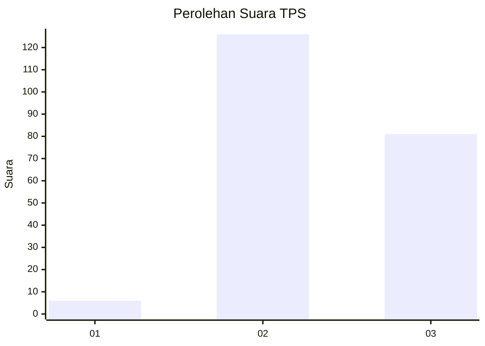
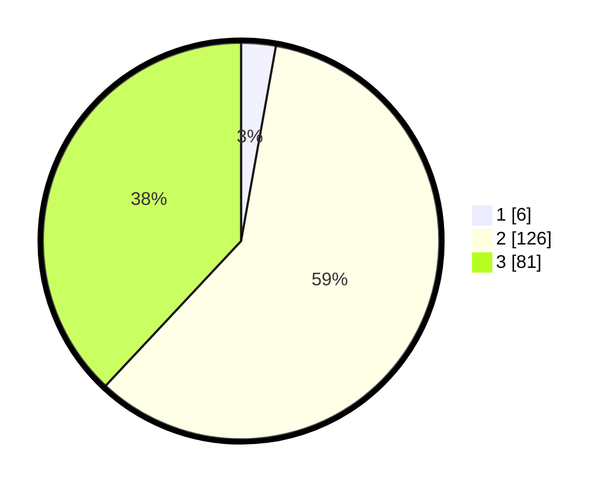

# Hasil

## Grafik

## Tabel

| No. | Nama Paslon    | Suara | Suara (raw) | Persentase |
|:--- |:-------------- | -----:| -----------:| ----------:|
| 1   | ANIES MUHAIMIN | 6     | [6][p-1]    | 2,82       |
| 2   | PRABOWO GIBRAN | 126   | [126][p-2]  | 59,15      |
| 3   | GANJAR MAHFUD  | 81    | [81][p-3]   | 38,03      |

[p-1]: https://github.com/gigit-pemilu/pemilu-2024-51-bali/blob/main/pilpres/hitung-suara/sub/51-bali/sub/71-kota-denpasar/sub/04-denpasar-utara/sub/2003-dangin-puri-kaja/sub/021-tps/sub/paslon-1.txt
[p-2]: https://github.com/gigit-pemilu/pemilu-2024-51-bali/blob/main/pilpres/hitung-suara/sub/51-bali/sub/71-kota-denpasar/sub/04-denpasar-utara/sub/2003-dangin-puri-kaja/sub/021-tps/sub/paslon-2.txt
[p-3]: https://github.com/gigit-pemilu/pemilu-2024-51-bali/blob/main/pilpres/hitung-suara/sub/51-bali/sub/71-kota-denpasar/sub/04-denpasar-utara/sub/2003-dangin-puri-kaja/sub/021-tps/sub/paslon-3.txt

## Foto C Plano

https://sirekap-obj-formc.kpu.go.id/2b84/pemilu/ppwp/51/71/04/20/03/5171042003021-20240214-213236--8baa62e7-7c91-47b8-879a-7c95a997d5b0.jpg

https://sirekap-obj-formc.kpu.go.id/2b84/pemilu/ppwp/51/71/04/20/03/5171042003021-20240214-214229--fa1febb7-71c2-413e-b43a-d29bb6d47ef0.jpg

https://sirekap-obj-formc.kpu.go.id/2b84/pemilu/ppwp/51/71/04/20/03/5171042003021-20240214-214425--aeef34bc-a013-4672-a003-e234c61ffb0a.jpg

## Metadata

| Key        | Value               |
| ---------- | ------------------- |
| Time Stamp | 2024-02-24 22:31:28 |

