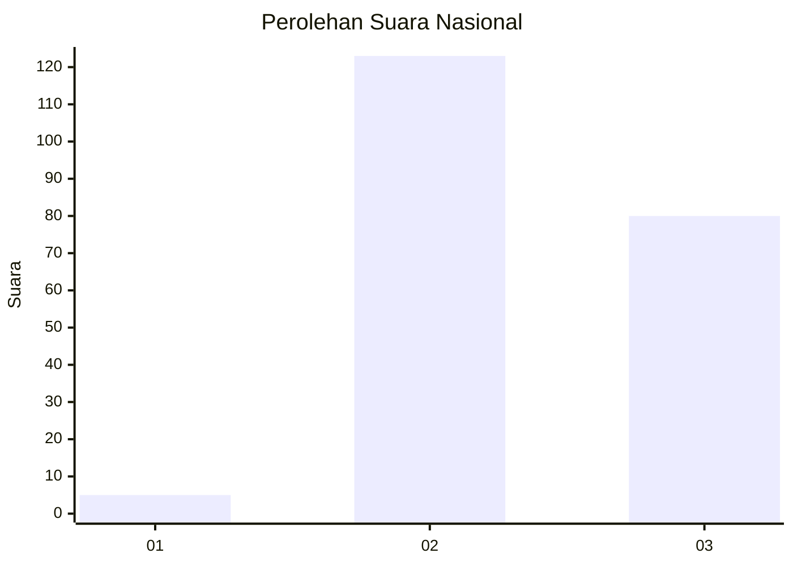
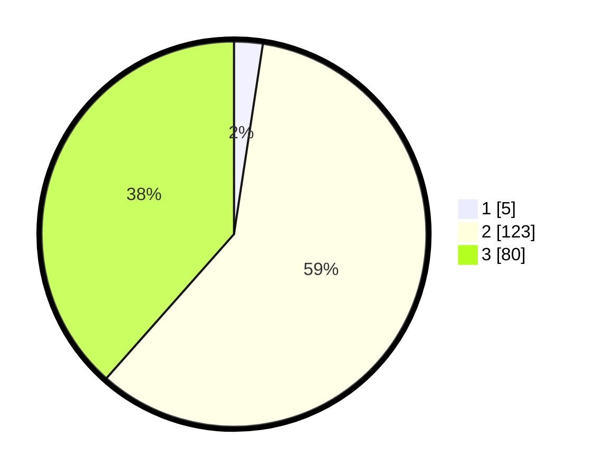

# Hasil

## Grafik

## Tabel

| No. | Nama Paslon    | Suara | Suara (raw) | Persentase |
|:--- |:-------------- | -----:| -----------:| ----------:|
| 1   | ANIES MUHAIMIN | 5     | [5][p-1]    | 2,40       |
| 2   | PRABOWO GIBRAN | 123   | [123][p-2]  | 59,13      |
| 3   | GANJAR MAHFUD  | 80    | [80][p-3]   | 38,46      |

[p-1]: https://github.com/gigit-pemilu/pemilu-2024/blob/main/pilpres/hitung-suara/sub/51-bali/sub/71-kota-denpasar/sub/04-denpasar-utara/sub/2003-dangin-puri-kaja/sub/022-tps/sub/paslon-1.txt
[p-2]: https://github.com/gigit-pemilu/pemilu-2024/blob/main/pilpres/hitung-suara/sub/51-bali/sub/71-kota-denpasar/sub/04-denpasar-utara/sub/2003-dangin-puri-kaja/sub/022-tps/sub/paslon-2.txt
[p-3]: https://github.com/gigit-pemilu/pemilu-2024/blob/main/pilpres/hitung-suara/sub/51-bali/sub/71-kota-denpasar/sub/04-denpasar-utara/sub/2003-dangin-puri-kaja/sub/022-tps/sub/paslon-3.txt

## Foto C Plano

https://sirekap-obj-formc.kpu.go.id/06a1/pemilu/ppwp/51/71/04/20/03/5171042003022-20240214-130745--0dc5f42f-d979-4a5d-bd80-3915ca0dc9f1.jpg

https://sirekap-obj-formc.kpu.go.id/06a1/pemilu/ppwp/51/71/04/20/03/5171042003022-20240214-130358--8b05f6cf-7d4b-4d2e-a099-37a34cd7710d.jpg

https://sirekap-obj-formc.kpu.go.id/06a1/pemilu/ppwp/51/71/04/20/03/5171042003022-20240214-131126--f20057a1-f3e6-4435-bf62-e42cf83402e5.jpg

## Metadata

| Key        | Value               |
| ---------- | ------------------- |
| Time Stamp | 2024-02-25 22:00:00 |

