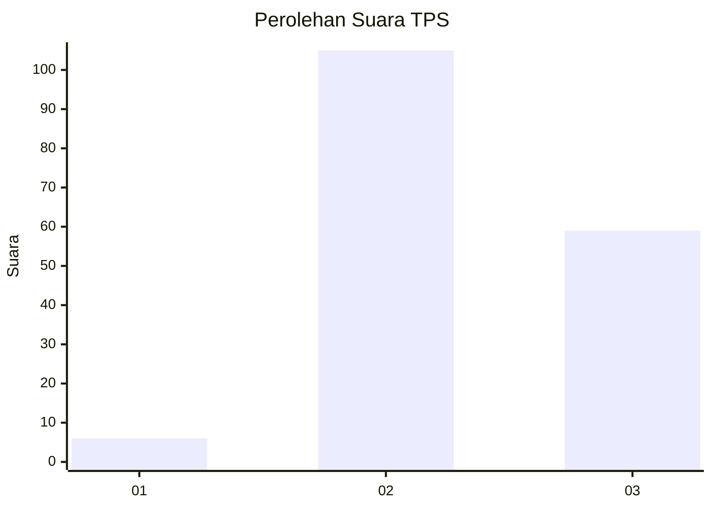
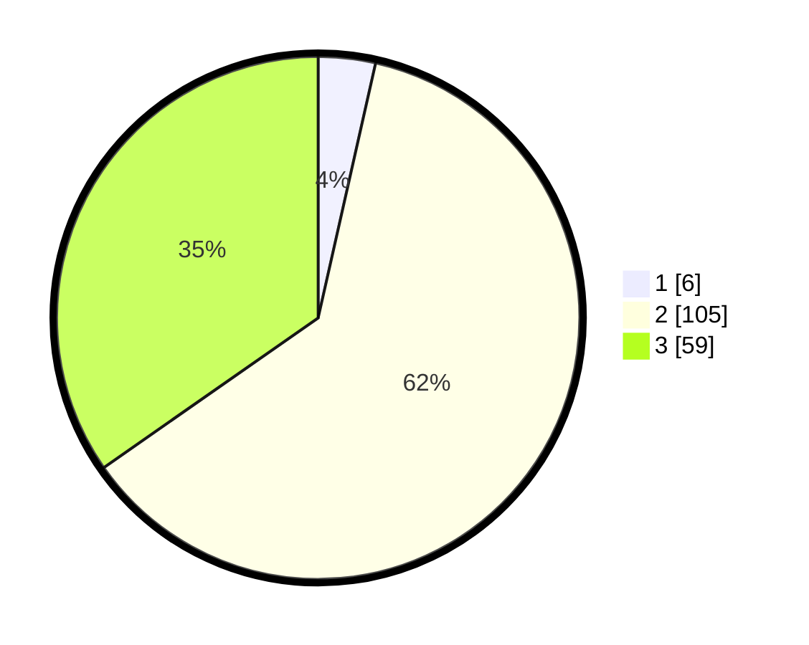

# Hasil

## Grafik

## Tabel

| No. | Nama Paslon    | Suara | Suara (raw) | Persentase |
|:--- |:-------------- | -----:| -----------:| ----------:|
| 1   | ANIES MUHAIMIN | 6     | [6][p-1]    | 3,53       |
| 2   | PRABOWO GIBRAN | 105   | [105][p-2]  | 61,76      |
| 3   | GANJAR MAHFUD  | 59    | [59][p-3]   | 34,71      |

[p-1]: https://github.com/gigit-pemilu/pemilu-2024-51-bali/blob/main/pilpres/hitung-suara/sub/51-bali/sub/71-kota-denpasar/sub/04-denpasar-utara/sub/2003-dangin-puri-kaja/sub/038-tps/sub/paslon-1.txt
[p-2]: https://github.com/gigit-pemilu/pemilu-2024-51-bali/blob/main/pilpres/hitung-suara/sub/51-bali/sub/71-kota-denpasar/sub/04-denpasar-utara/sub/2003-dangin-puri-kaja/sub/038-tps/sub/paslon-2.txt
[p-3]: https://github.com/gigit-pemilu/pemilu-2024-51-bali/blob/main/pilpres/hitung-suara/sub/51-bali/sub/71-kota-denpasar/sub/04-denpasar-utara/sub/2003-dangin-puri-kaja/sub/038-tps/sub/paslon-3.txt

## Foto C Plano

https://sirekap-obj-formc.kpu.go.id/5f61/pemilu/ppwp/51/71/04/20/03/5171042003038-20240214-195141--192b441d-4ce6-498f-8c82-23e559dd1f02.jpg

https://sirekap-obj-formc.kpu.go.id/5f61/pemilu/ppwp/51/71/04/20/03/5171042003038-20240214-131646--266c1d53-5b19-43d4-92e7-041acbd21565.jpg

https://sirekap-obj-formc.kpu.go.id/5f61/pemilu/ppwp/51/71/04/20/03/5171042003038-20240214-195255--05b92d46-1d1a-4de0-9006-e97e1d9b8354.jpg

## Metadata

| Key        | Value               |
| ---------- | ------------------- |
| Time Stamp | 2024-02-24 22:31:28 |

