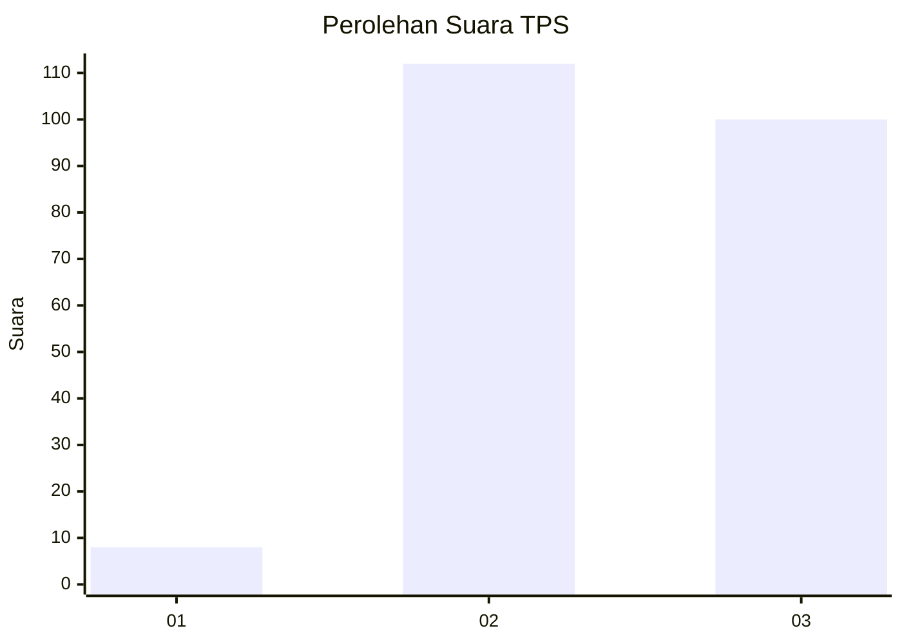
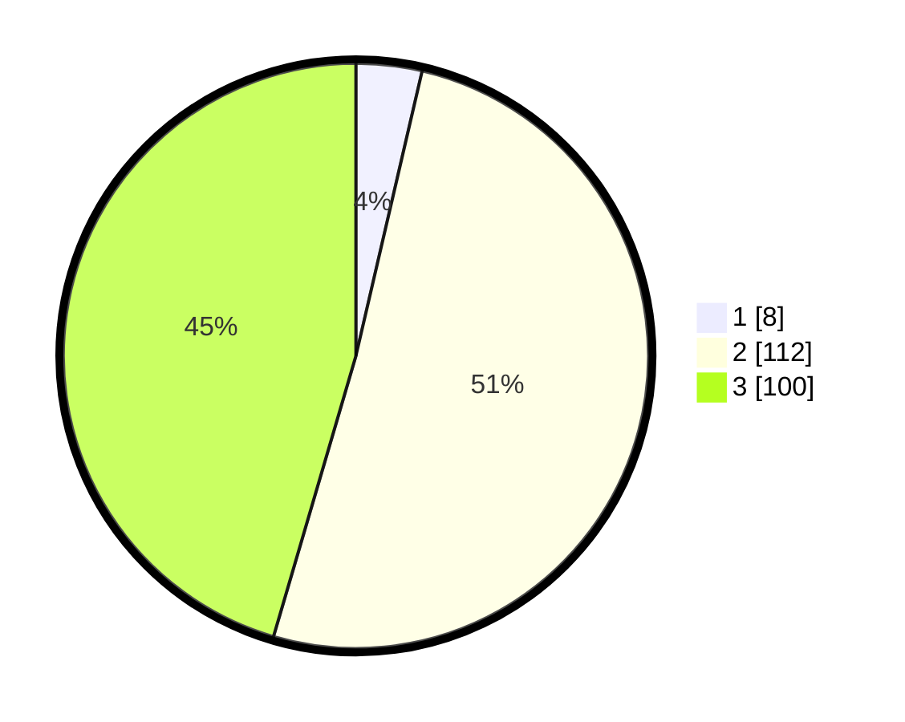

# Hasil

## Grafik

## Tabel

| No. | Nama Paslon    | Suara | Suara (raw) | Persentase |
|:--- |:-------------- | -----:| -----------:| ----------:|
| 1   | ANIES MUHAIMIN | 8     | [8][p-1]    | 3,64       |
| 2   | PRABOWO GIBRAN | 112   | [112][p-2]  | 50,91      |
| 3   | GANJAR MAHFUD  | 100   | [100][p-3]  | 45,45      |

[p-1]: https://github.com/gigit-pemilu/pemilu-2024-51-bali/blob/main/pilpres/hitung-suara/sub/51-bali/sub/71-kota-denpasar/sub/04-denpasar-utara/sub/2005-pemecutan-kaja/sub/048-tps/sub/paslon-1.txt
[p-2]: https://github.com/gigit-pemilu/pemilu-2024-51-bali/blob/main/pilpres/hitung-suara/sub/51-bali/sub/71-kota-denpasar/sub/04-denpasar-utara/sub/2005-pemecutan-kaja/sub/048-tps/sub/paslon-2.txt
[p-3]: https://github.com/gigit-pemilu/pemilu-2024-51-bali/blob/main/pilpres/hitung-suara/sub/51-bali/sub/71-kota-denpasar/sub/04-denpasar-utara/sub/2005-pemecutan-kaja/sub/048-tps/sub/paslon-3.txt

## Foto C Plano

https://sirekap-obj-formc.kpu.go.id/10f9/pemilu/ppwp/51/71/04/20/05/5171042005048-20240216-124321--adfc7e06-1ed1-40c8-b088-5bb5a8a6ac4a.jpg

https://sirekap-obj-formc.kpu.go.id/10f9/pemilu/ppwp/51/71/04/20/05/5171042005048-20240216-124332--5c725f54-e075-4f0e-8675-547f6cb2c72f.jpg

https://sirekap-obj-formc.kpu.go.id/10f9/pemilu/ppwp/51/71/04/20/05/5171042005048-20240216-124326--a37df2cc-6002-44e5-b2e7-af6dbc7dd37f.jpg

## Metadata

| Key        | Value               |
| ---------- | ------------------- |
| Time Stamp | 2024-02-21 10:00:00 |

## DATA PEMILIH TETAP

Jumlah pemilih dalam DPT: **274**.
 * L: **132**.
 * P: **142**.

## DATA PENGGUNA HAK PILIH

Jumlah pengguna hak pilih dalam DPT: **208**.
 * L: **102**.
 * P: **106**.

Jumlah pengguna hak pilih dalam DPTb: **2**.
 * L: **1**.
 * P: **1**.

Jumlah pengguna hak pilih dalam DPK: **10**.
 * L: **5**.
 * P: **5**.

Jumlah pengguna hak pilih: **220**.
 * L: **108**.
 * P: **112**.

## JUMLAH SUARA SAH DAN TIDAK SAH

JUMLAH SELURUH SUARA SAH: **220**.

JUMLAH SUARA TIDAK SAH: **0**.

JUMLAH SELURUH SUARA SAH DAN SUARA TIDAK SAH: **220**.

