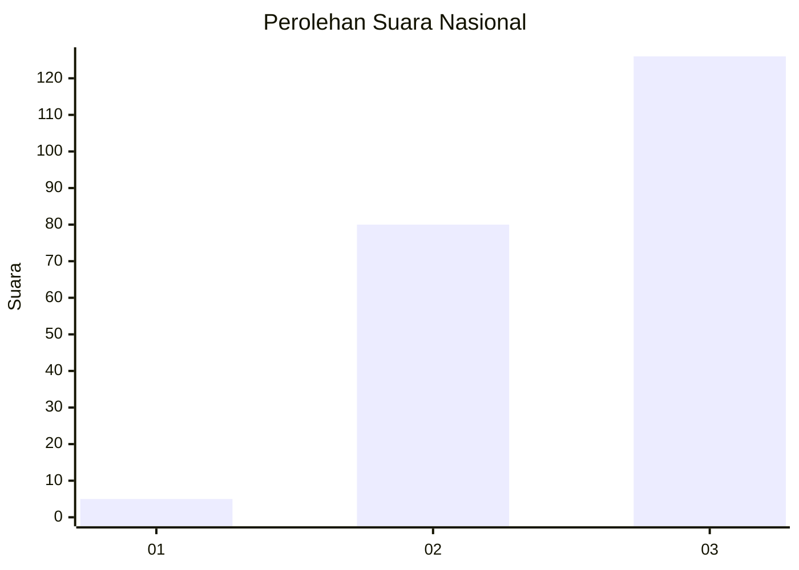
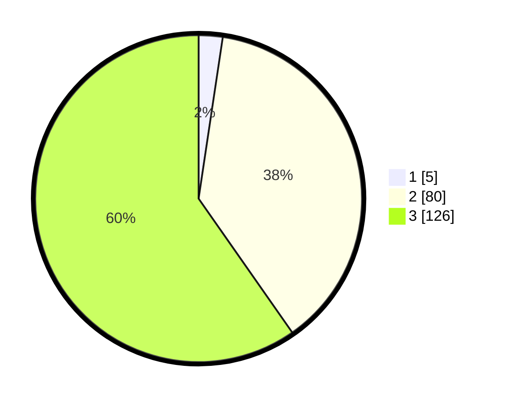

# Hasil

## Grafik

## Tabel

| No. | Nama Paslon    | Suara | Suara (raw) | Persentase |
|:--- |:-------------- | -----:| -----------:| ----------:|
| 1   | ANIES MUHAIMIN | 5     | [5][p-1]    | 2,37       |
| 2   | PRABOWO GIBRAN | 80    | [80][p-2]   | 37,91      |
| 3   | GANJAR MAHFUD  | 126   | [126][p-3]  | 59,72      |

[p-1]: https://github.com/gigit-pemilu/pemilu-2024/blob/main/pilpres/hitung-suara/sub/51-bali/sub/71-kota-denpasar/sub/04-denpasar-utara/sub/2006-dauh-puri-kaja/sub/011-tps/sub/paslon-1.txt
[p-2]: https://github.com/gigit-pemilu/pemilu-2024/blob/main/pilpres/hitung-suara/sub/51-bali/sub/71-kota-denpasar/sub/04-denpasar-utara/sub/2006-dauh-puri-kaja/sub/011-tps/sub/paslon-2.txt
[p-3]: https://github.com/gigit-pemilu/pemilu-2024/blob/main/pilpres/hitung-suara/sub/51-bali/sub/71-kota-denpasar/sub/04-denpasar-utara/sub/2006-dauh-puri-kaja/sub/011-tps/sub/paslon-3.txt

## Foto C Plano

https://sirekap-obj-formc.kpu.go.id/8c40/pemilu/ppwp/51/71/04/20/06/5171042006011-20240214-234041--655aa14d-cbc2-4e2e-a57b-38d3d01cc26b.jpg

https://sirekap-obj-formc.kpu.go.id/8c40/pemilu/ppwp/51/71/04/20/06/5171042006011-20240214-234133--f49b891b-b6a8-4a8a-a1b9-e3bde8577fe9.jpg

https://sirekap-obj-formc.kpu.go.id/8c40/pemilu/ppwp/51/71/04/20/06/5171042006011-20240214-234151--1be3c7a0-f585-4f1a-ba0e-becba757f286.jpg

## Metadata

| Key        | Value               |
| ---------- | ------------------- |
| Time Stamp | 2024-02-24 22:31:28 |

