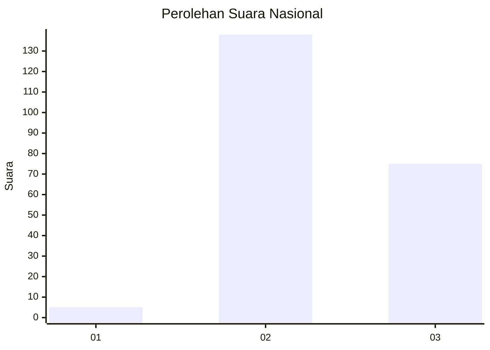
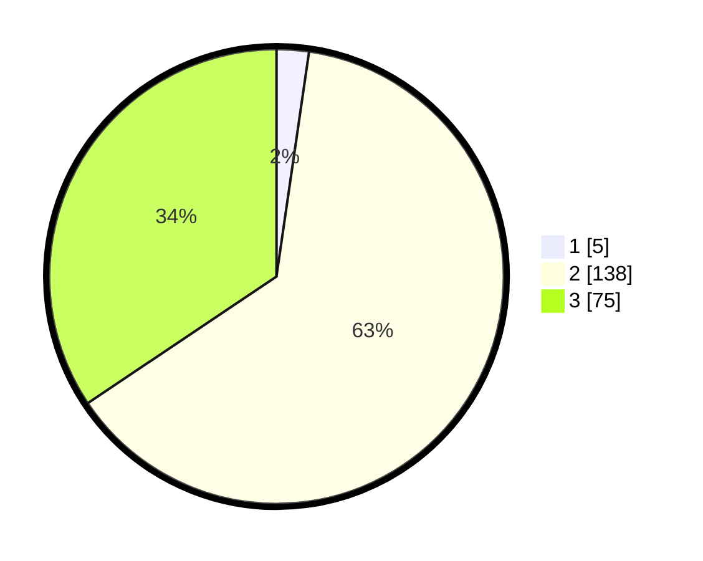

# Hasil

## Grafik

## Tabel

| No. | Nama Paslon    | Suara | Suara (raw) | Persentase |
|:--- |:-------------- | -----:| -----------:| ----------:|
| 1   | ANIES MUHAIMIN | 5     | [5][p-1]    | 2,29       |
| 2   | PRABOWO GIBRAN | 138   | [138][p-2]  | 63,30      |
| 3   | GANJAR MAHFUD  | 75    | [75][p-3]   | 34,40      |

[p-1]: https://github.com/gigit-pemilu/pemilu-2024/blob/main/pilpres/hitung-suara/sub/51-bali/sub/71-kota-denpasar/sub/04-denpasar-utara/sub/2006-dauh-puri-kaja/sub/018-tps/sub/paslon-1.txt
[p-2]: https://github.com/gigit-pemilu/pemilu-2024/blob/main/pilpres/hitung-suara/sub/51-bali/sub/71-kota-denpasar/sub/04-denpasar-utara/sub/2006-dauh-puri-kaja/sub/018-tps/sub/paslon-2.txt
[p-3]: https://github.com/gigit-pemilu/pemilu-2024/blob/main/pilpres/hitung-suara/sub/51-bali/sub/71-kota-denpasar/sub/04-denpasar-utara/sub/2006-dauh-puri-kaja/sub/018-tps/sub/paslon-3.txt

## Foto C Plano

https://sirekap-obj-formc.kpu.go.id/3460/pemilu/ppwp/51/71/04/20/06/5171042006018-20240214-132641--c60a652b-1b8f-4d65-b7e8-c8f857781925.jpg

https://sirekap-obj-formc.kpu.go.id/3460/pemilu/ppwp/51/71/04/20/06/5171042006018-20240214-132859--63f18ee4-f73b-4a52-a9cc-d44db893bbf8.jpg

https://sirekap-obj-formc.kpu.go.id/3460/pemilu/ppwp/51/71/04/20/06/5171042006018-20240214-133114--e2207a07-defc-43b0-ac8b-8ecc99f92bdd.jpg

## Metadata

| Key        | Value               |
| ---------- | ------------------- |
| Time Stamp | 2024-02-24 22:31:28 |

