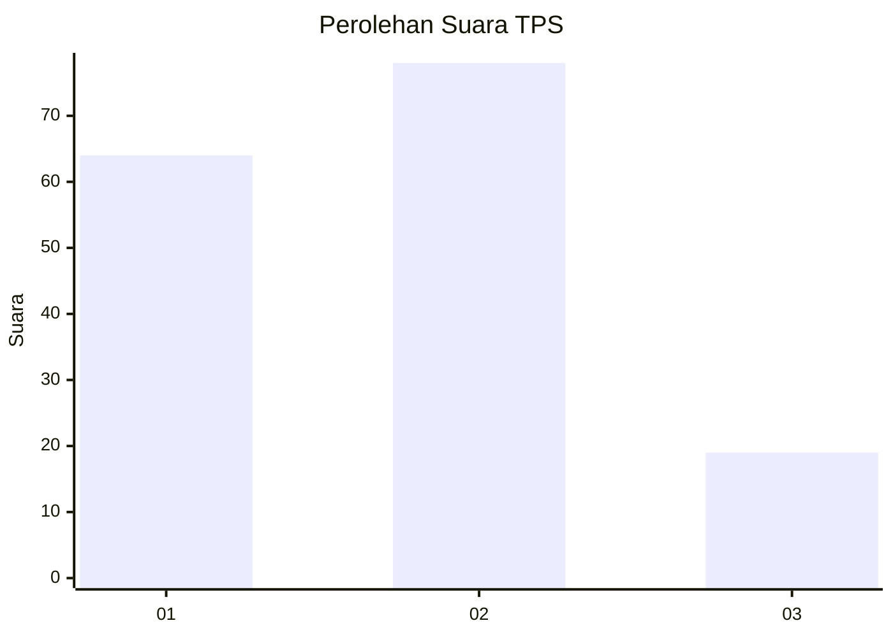
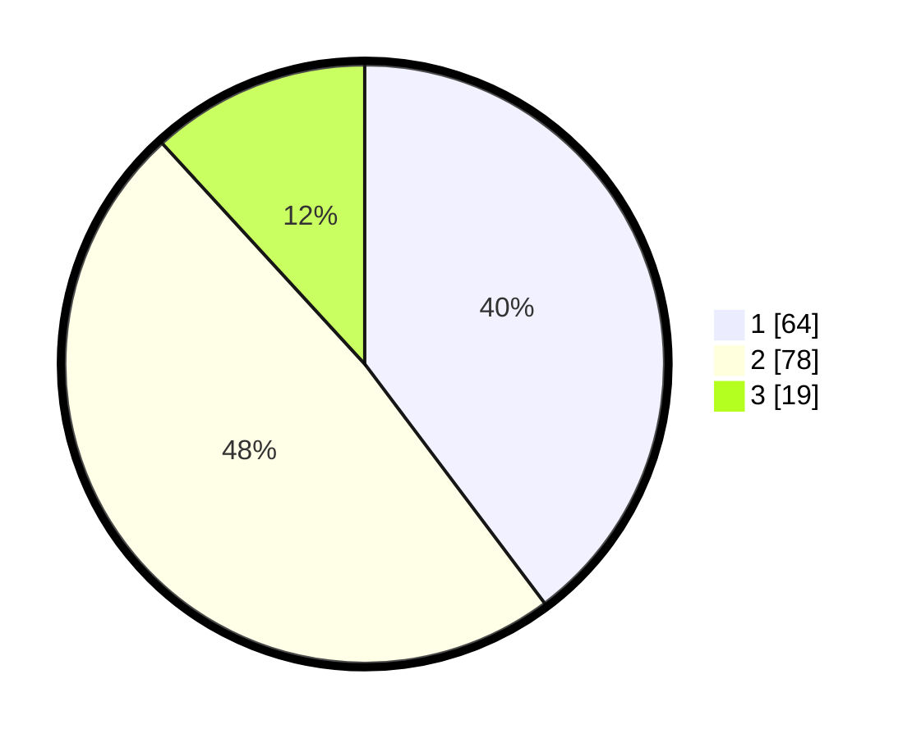

# Hasil

## Grafik

## Tabel

| No. | Nama Paslon    | Suara | Suara (raw) | Persentase |
|:--- |:-------------- | -----:| -----------:| ----------:|
| 1   | ANIES MUHAIMIN | 64    | [64][p-1]   | 39,75      |
| 2   | PRABOWO GIBRAN | 78    | [78][p-2]   | 48,45      |
| 3   | GANJAR MAHFUD  | 19    | [19][p-3]   | 11,80      |

[p-1]: https://github.com/gigit-pemilu/pemilu-2024-51-bali/blob/main/pilpres/hitung-suara/sub/51-bali/sub/71-kota-denpasar/sub/04-denpasar-utara/sub/2006-dauh-puri-kaja/sub/031-tps/sub/paslon-1.txt
[p-2]: https://github.com/gigit-pemilu/pemilu-2024-51-bali/blob/main/pilpres/hitung-suara/sub/51-bali/sub/71-kota-denpasar/sub/04-denpasar-utara/sub/2006-dauh-puri-kaja/sub/031-tps/sub/paslon-2.txt
[p-3]: https://github.com/gigit-pemilu/pemilu-2024-51-bali/blob/main/pilpres/hitung-suara/sub/51-bali/sub/71-kota-denpasar/sub/04-denpasar-utara/sub/2006-dauh-puri-kaja/sub/031-tps/sub/paslon-3.txt

## Foto C Plano

https://sirekap-obj-formc.kpu.go.id/31b9/pemilu/ppwp/51/71/04/20/06/5171042006031-20240214-132206--88c925c8-6118-479f-bb29-f229fc2bf8d5.jpg

https://sirekap-obj-formc.kpu.go.id/31b9/pemilu/ppwp/51/71/04/20/06/5171042006031-20240214-132024--66151cd9-172e-44a6-aa42-5d6e596f6676.jpg

https://sirekap-obj-formc.kpu.go.id/31b9/pemilu/ppwp/51/71/04/20/06/5171042006031-20240214-132117--67b760f1-817d-42b3-ba90-d2b7af7ea2c1.jpg

## Metadata

| Key        | Value               |
| ---------- | ------------------- |
| Time Stamp | 2024-02-24 22:31:28 |

