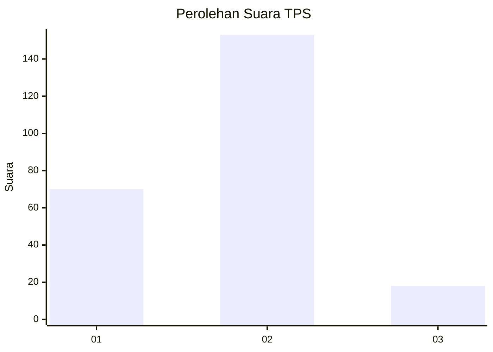
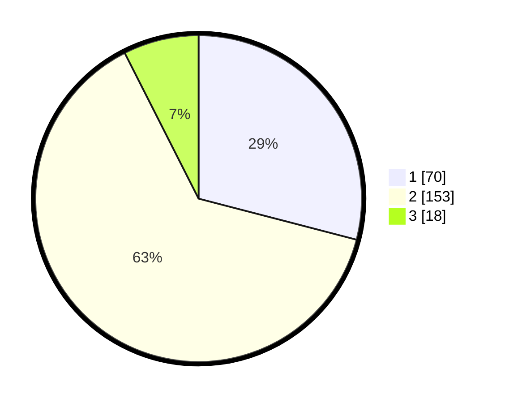

# Hasil

## Grafik

## Tabel

| No. | Nama Paslon    | Suara | Suara (raw) | Persentase |
|:--- |:-------------- | -----:| -----------:| ----------:|
| 1   | ANIES MUHAIMIN | 70    | [70][p-1]   | 29,05      |
| 2   | PRABOWO GIBRAN | 153   | [153][p-2]  | 63,49      |
| 3   | GANJAR MAHFUD  | 18    | [18][p-3]   | 7,47       |

[p-1]: https://github.com/gigit-pemilu/pemilu-2024-51-bali/blob/main/pilpres/hitung-suara/sub/51-bali/sub/71-kota-denpasar/sub/04-denpasar-utara/sub/2006-dauh-puri-kaja/sub/036-tps/sub/paslon-1.txt
[p-2]: https://github.com/gigit-pemilu/pemilu-2024-51-bali/blob/main/pilpres/hitung-suara/sub/51-bali/sub/71-kota-denpasar/sub/04-denpasar-utara/sub/2006-dauh-puri-kaja/sub/036-tps/sub/paslon-2.txt
[p-3]: https://github.com/gigit-pemilu/pemilu-2024-51-bali/blob/main/pilpres/hitung-suara/sub/51-bali/sub/71-kota-denpasar/sub/04-denpasar-utara/sub/2006-dauh-puri-kaja/sub/036-tps/sub/paslon-3.txt

## Foto C Plano

https://sirekap-obj-formc.kpu.go.id/fdd0/pemilu/ppwp/51/71/04/20/06/5171042006036-20240214-213357--5890b283-5473-4812-acf9-1b7c15bde435.jpg

https://sirekap-obj-formc.kpu.go.id/fdd0/pemilu/ppwp/51/71/04/20/06/5171042006036-20240214-213430--0e0f49fc-c532-4b4c-b50a-d5bdcfdce508.jpg

https://sirekap-obj-formc.kpu.go.id/fdd0/pemilu/ppwp/51/71/04/20/06/5171042006036-20240214-213547--78424a8b-48ad-4a5e-b8d4-f3596ebde53b.jpg

## Metadata

| Key        | Value               |
| ---------- | ------------------- |
| Time Stamp | 2024-02-24 22:31:28 |

