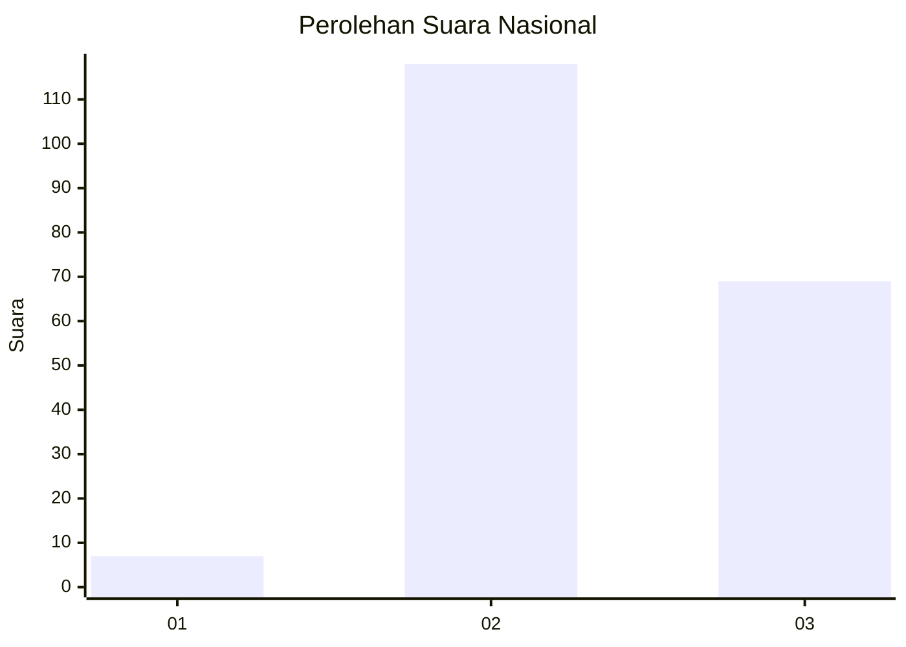
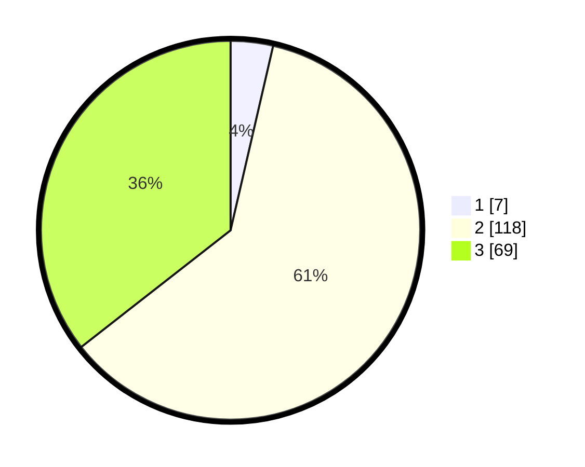

# Hasil

## Grafik

## Tabel

| No. | Nama Paslon    | Suara | Suara (raw) | Persentase |
|:--- |:-------------- | -----:| -----------:| ----------:|
| 1   | ANIES MUHAIMIN | 7     | [7][p-1]    | 3,61       |
| 2   | PRABOWO GIBRAN | 118   | [118][p-2]  | 60,82      |
| 3   | GANJAR MAHFUD  | 69    | [69][p-3]   | 35,57      |

[p-1]: https://github.com/gigit-pemilu/pemilu-2024/blob/main/pilpres/hitung-suara/sub/51-bali/sub/71-kota-denpasar/sub/04-denpasar-utara/sub/2008-ubung-kaja/sub/011-tps/sub/paslon-1.txt
[p-2]: https://github.com/gigit-pemilu/pemilu-2024/blob/main/pilpres/hitung-suara/sub/51-bali/sub/71-kota-denpasar/sub/04-denpasar-utara/sub/2008-ubung-kaja/sub/011-tps/sub/paslon-2.txt
[p-3]: https://github.com/gigit-pemilu/pemilu-2024/blob/main/pilpres/hitung-suara/sub/51-bali/sub/71-kota-denpasar/sub/04-denpasar-utara/sub/2008-ubung-kaja/sub/011-tps/sub/paslon-3.txt

## Foto C Plano

https://sirekap-obj-formc.kpu.go.id/d654/pemilu/ppwp/51/71/04/20/08/5171042008011-20240214-132849--6bd0057f-36e4-43bc-9d85-495bb59c31c9.jpg

https://sirekap-obj-formc.kpu.go.id/d654/pemilu/ppwp/51/71/04/20/08/5171042008011-20240214-133016--1b09b5c0-f156-42ea-8fda-8681de1f5ea9.jpg

https://sirekap-obj-formc.kpu.go.id/d654/pemilu/ppwp/51/71/04/20/08/5171042008011-20240214-132526--edeb6e2b-4314-4ef5-93f0-c80b5043e068.jpg

## Metadata

| Key        | Value               |
| ---------- | ------------------- |
| Time Stamp | 2024-02-24 22:31:28 |

