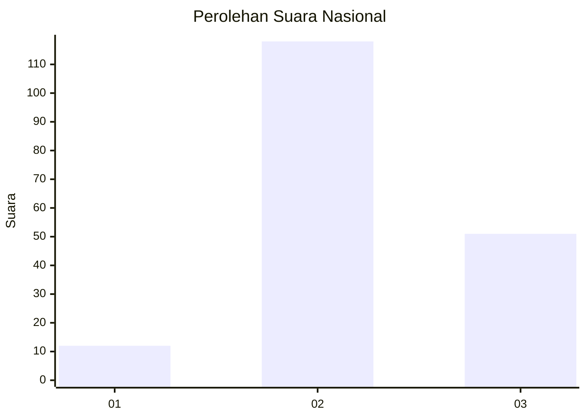
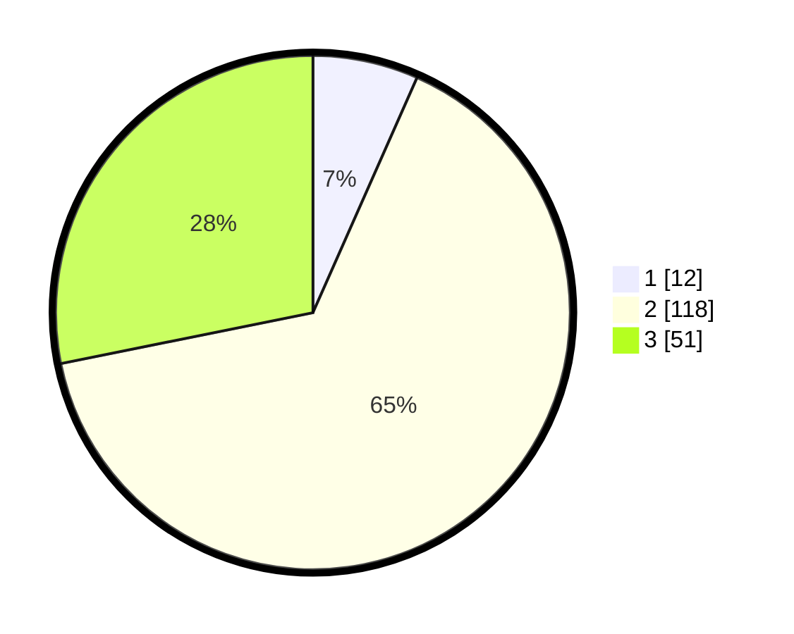

# Hasil

## Grafik

## Tabel

| No. | Nama Paslon    | Suara | Suara (raw) | Persentase |
|:--- |:-------------- | -----:| -----------:| ----------:|
| 1   | ANIES MUHAIMIN | 12    | [12][p-1]   | 6,63       |
| 2   | PRABOWO GIBRAN | 118   | [118][p-2]  | 65,19      |
| 3   | GANJAR MAHFUD  | 51    | [51][p-3]   | 28,18      |

[p-1]: https://github.com/gigit-pemilu/pemilu-2024/blob/main/pilpres/hitung-suara/sub/51-bali/sub/71-kota-denpasar/sub/04-denpasar-utara/sub/2008-ubung-kaja/sub/017-tps/sub/paslon-1.txt
[p-2]: https://github.com/gigit-pemilu/pemilu-2024/blob/main/pilpres/hitung-suara/sub/51-bali/sub/71-kota-denpasar/sub/04-denpasar-utara/sub/2008-ubung-kaja/sub/017-tps/sub/paslon-2.txt
[p-3]: https://github.com/gigit-pemilu/pemilu-2024/blob/main/pilpres/hitung-suara/sub/51-bali/sub/71-kota-denpasar/sub/04-denpasar-utara/sub/2008-ubung-kaja/sub/017-tps/sub/paslon-3.txt

## Foto C Plano

https://sirekap-obj-formc.kpu.go.id/2e57/pemilu/ppwp/51/71/04/20/08/5171042008017-20240214-132732--27a5eb43-3964-4623-9122-b9f2f5489e39.jpg

https://sirekap-obj-formc.kpu.go.id/2e57/pemilu/ppwp/51/71/04/20/08/5171042008017-20240214-132455--8a0e9106-5b7c-46f3-8d08-ef65459dc086.jpg

https://sirekap-obj-formc.kpu.go.id/2e57/pemilu/ppwp/51/71/04/20/08/5171042008017-20240214-133058--cad91789-d3d4-48ff-b36d-57f08a0ccc3f.jpg

## Metadata

| Key        | Value               |
| ---------- | ------------------- |
| Time Stamp | 2024-02-24 22:31:28 |

