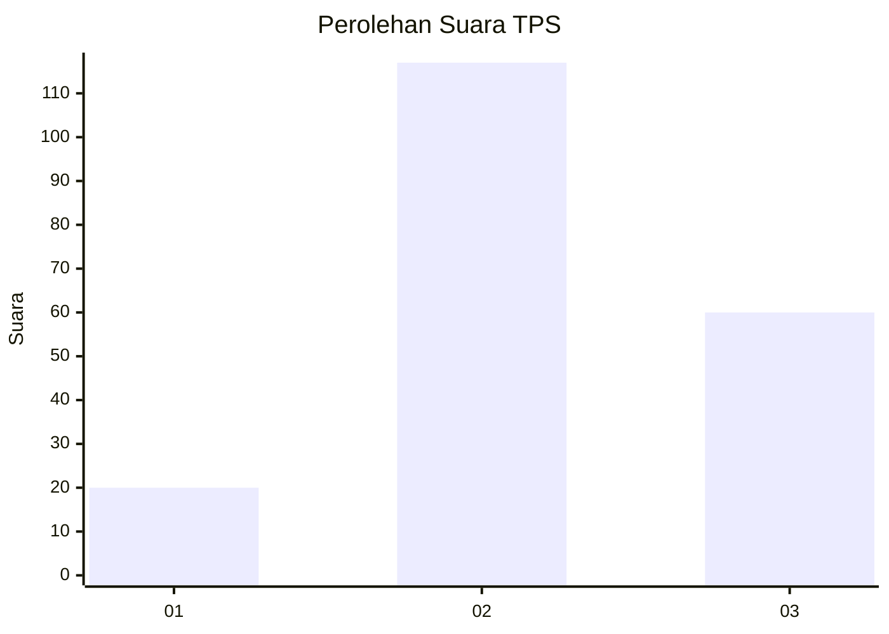
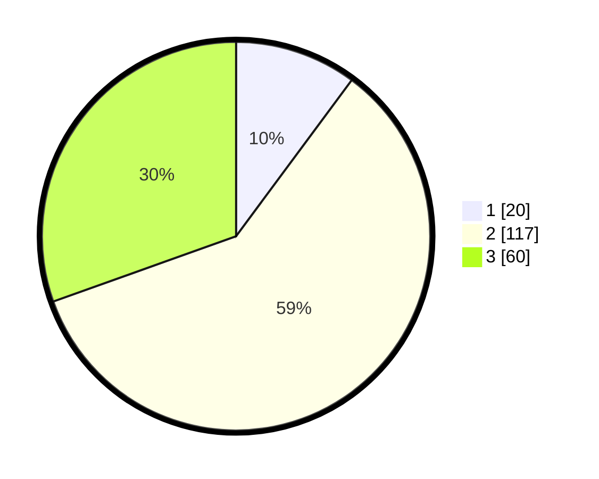

# Hasil

## Grafik

## Tabel

| No. | Nama Paslon    | Suara | Suara (raw) | Persentase |
|:--- |:-------------- | -----:| -----------:| ----------:|
| 1   | ANIES MUHAIMIN | 20    | [20][p-1]   | 10,15      |
| 2   | PRABOWO GIBRAN | 117   | [117][p-2]  | 59,39      |
| 3   | GANJAR MAHFUD  | 60    | [60][p-3]   | 30,46      |

[p-1]: https://github.com/gigit-pemilu/pemilu-2024-51-bali/blob/main/pilpres/hitung-suara/sub/51-bali/sub/71-kota-denpasar/sub/04-denpasar-utara/sub/2008-ubung-kaja/sub/025-tps/sub/paslon-1.txt
[p-2]: https://github.com/gigit-pemilu/pemilu-2024-51-bali/blob/main/pilpres/hitung-suara/sub/51-bali/sub/71-kota-denpasar/sub/04-denpasar-utara/sub/2008-ubung-kaja/sub/025-tps/sub/paslon-2.txt
[p-3]: https://github.com/gigit-pemilu/pemilu-2024-51-bali/blob/main/pilpres/hitung-suara/sub/51-bali/sub/71-kota-denpasar/sub/04-denpasar-utara/sub/2008-ubung-kaja/sub/025-tps/sub/paslon-3.txt

## Foto C Plano

https://sirekap-obj-formc.kpu.go.id/ca18/pemilu/ppwp/51/71/04/20/08/5171042008025-20240215-000929--5dc72004-a038-4ce8-a0e0-53d901667008.jpg

https://sirekap-obj-formc.kpu.go.id/ca18/pemilu/ppwp/51/71/04/20/08/5171042008025-20240215-000102--d11c76d5-0f99-48d5-9d28-53b5c1bd9e59.jpg

https://sirekap-obj-formc.kpu.go.id/ca18/pemilu/ppwp/51/71/04/20/08/5171042008025-20240215-000251--246e6db7-32ef-46c9-8f77-a1ffefb76b43.jpg

## Metadata

| Key        | Value               |
| ---------- | ------------------- |
| Time Stamp | 2024-02-24 22:31:28 |

