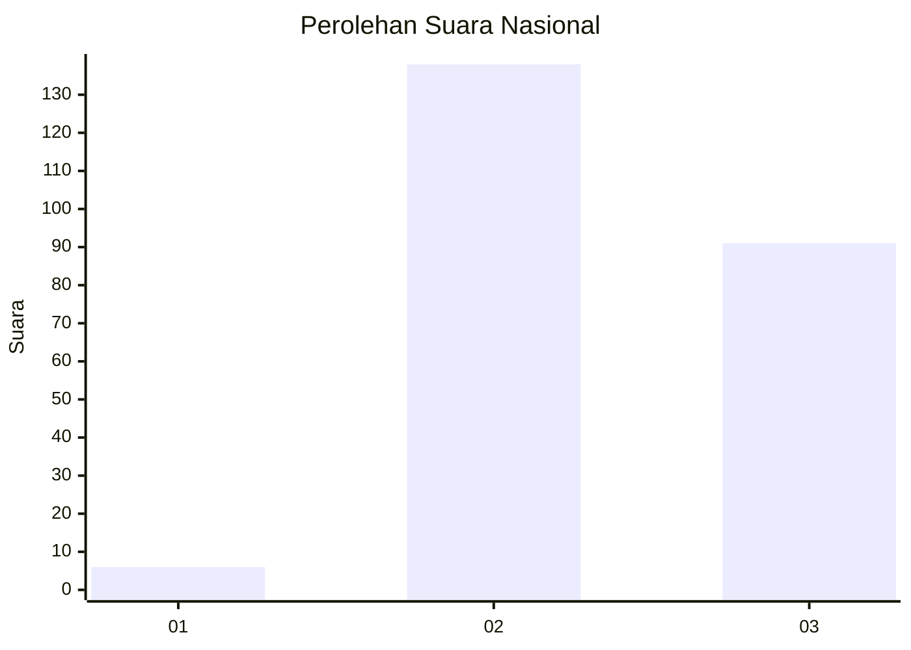
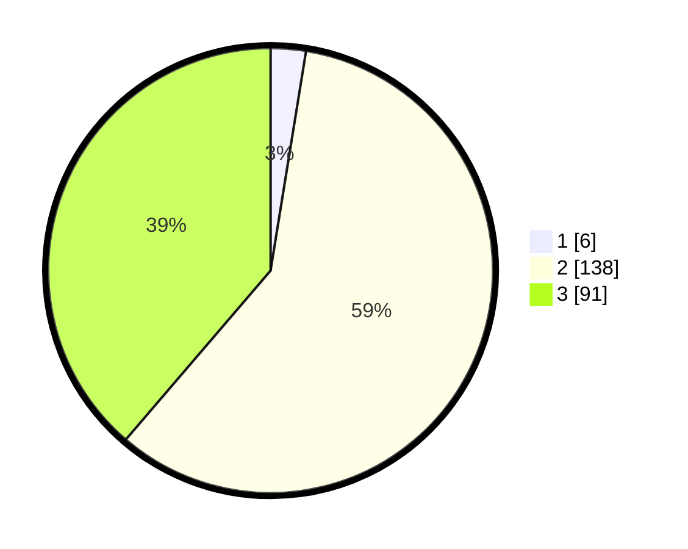

# Hasil

## Grafik

## Tabel

| No. | Nama Paslon    | Suara | Suara (raw) | Persentase |
|:--- |:-------------- | -----:| -----------:| ----------:|
| 1   | ANIES MUHAIMIN | 6     | [6][p-1]    | 2,55       |
| 2   | PRABOWO GIBRAN | 138   | [138][p-2]  | 58,72      |
| 3   | GANJAR MAHFUD  | 91    | [91][p-3]   | 38,72      |

[p-1]: https://github.com/gigit-pemilu/pemilu-2024/blob/main/pilpres/hitung-suara/sub/51-bali/sub/71-kota-denpasar/sub/04-denpasar-utara/sub/2008-ubung-kaja/sub/029-tps/sub/paslon-1.txt
[p-2]: https://github.com/gigit-pemilu/pemilu-2024/blob/main/pilpres/hitung-suara/sub/51-bali/sub/71-kota-denpasar/sub/04-denpasar-utara/sub/2008-ubung-kaja/sub/029-tps/sub/paslon-2.txt
[p-3]: https://github.com/gigit-pemilu/pemilu-2024/blob/main/pilpres/hitung-suara/sub/51-bali/sub/71-kota-denpasar/sub/04-denpasar-utara/sub/2008-ubung-kaja/sub/029-tps/sub/paslon-3.txt

## Foto C Plano

https://sirekap-obj-formc.kpu.go.id/9f2f/pemilu/ppwp/51/71/04/20/08/5171042008029-20240214-200034--da12d6f9-650c-416a-a508-9bbd8b07b181.jpg

https://sirekap-obj-formc.kpu.go.id/9f2f/pemilu/ppwp/51/71/04/20/08/5171042008029-20240214-200302--b7d7041f-786a-4c85-b739-1c686f6f46af.jpg

https://sirekap-obj-formc.kpu.go.id/9f2f/pemilu/ppwp/51/71/04/20/08/5171042008029-20240214-200920--8459599c-8f97-461a-8c73-503fd801726d.jpg

## Metadata

| Key        | Value               |
| ---------- | ------------------- |
| Time Stamp | 2024-02-24 22:31:28 |

