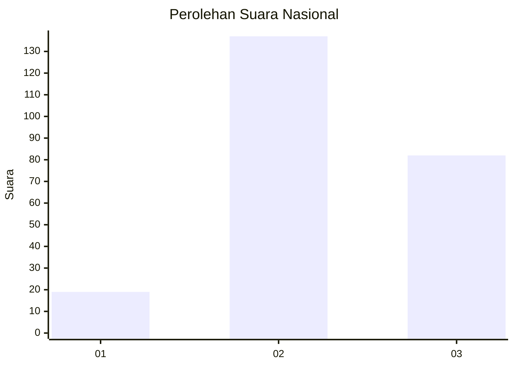
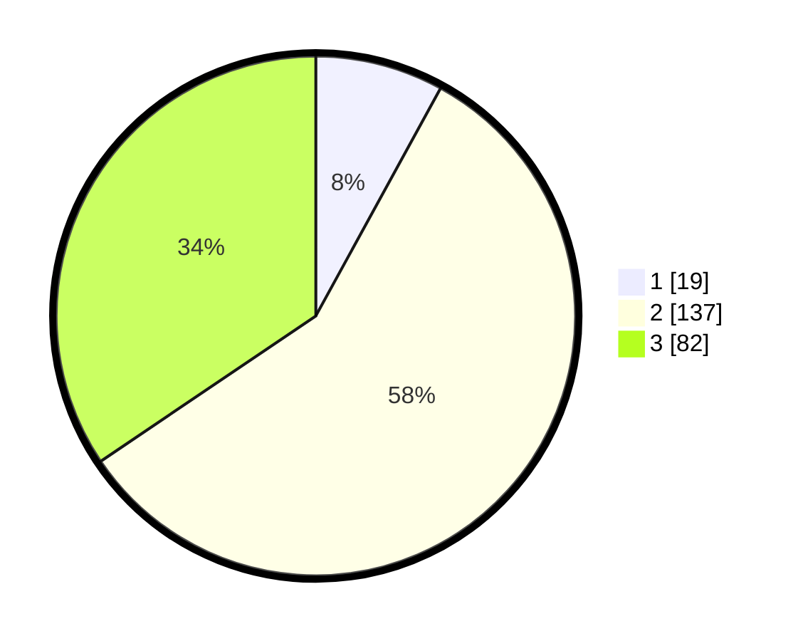

# Hasil

## Grafik

## Tabel

| No. | Nama Paslon    | Suara | Suara (raw) | Persentase |
|:--- |:-------------- | -----:| -----------:| ----------:|
| 1   | ANIES MUHAIMIN | 19    | [19][p-1]   | 7,98       |
| 2   | PRABOWO GIBRAN | 137   | [137][p-2]  | 57,56      |
| 3   | GANJAR MAHFUD  | 82    | [82][p-3]   | 34,45      |

[p-1]: https://github.com/gigit-pemilu/pemilu-2024/blob/main/pilpres/hitung-suara/sub/51-bali/sub/71-kota-denpasar/sub/04-denpasar-utara/sub/2008-ubung-kaja/sub/033-tps/sub/paslon-1.txt
[p-2]: https://github.com/gigit-pemilu/pemilu-2024/blob/main/pilpres/hitung-suara/sub/51-bali/sub/71-kota-denpasar/sub/04-denpasar-utara/sub/2008-ubung-kaja/sub/033-tps/sub/paslon-2.txt
[p-3]: https://github.com/gigit-pemilu/pemilu-2024/blob/main/pilpres/hitung-suara/sub/51-bali/sub/71-kota-denpasar/sub/04-denpasar-utara/sub/2008-ubung-kaja/sub/033-tps/sub/paslon-3.txt

## Foto C Plano

https://sirekap-obj-formc.kpu.go.id/3506/pemilu/ppwp/51/71/04/20/08/5171042008033-20240215-122925--c439811a-5cc5-4047-98ba-25c090d9febe.jpg

https://sirekap-obj-formc.kpu.go.id/3506/pemilu/ppwp/51/71/04/20/08/5171042008033-20240215-123116--a7c13db6-e762-4de2-8bb9-cb5bf83fd2c9.jpg

https://sirekap-obj-formc.kpu.go.id/3506/pemilu/ppwp/51/71/04/20/08/5171042008033-20240215-123249--4b93caf1-a6f4-41e7-87cb-8f2b368bae5f.jpg

## Metadata

| Key        | Value               |
| ---------- | ------------------- |
| Time Stamp | 2024-02-25 18:00:00 |

