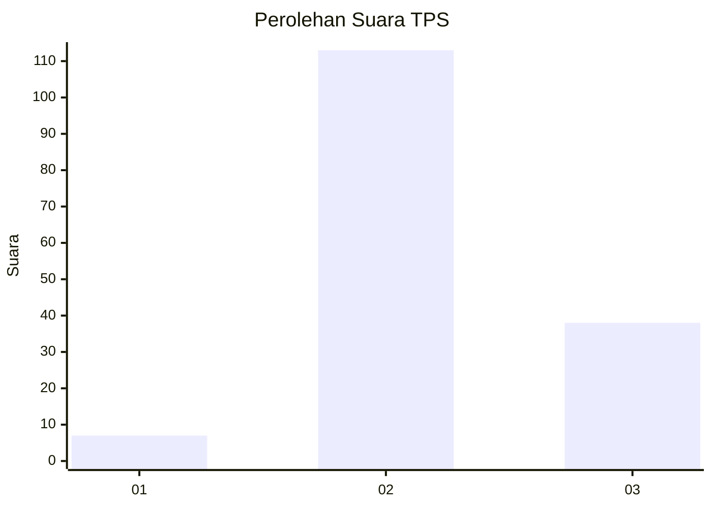
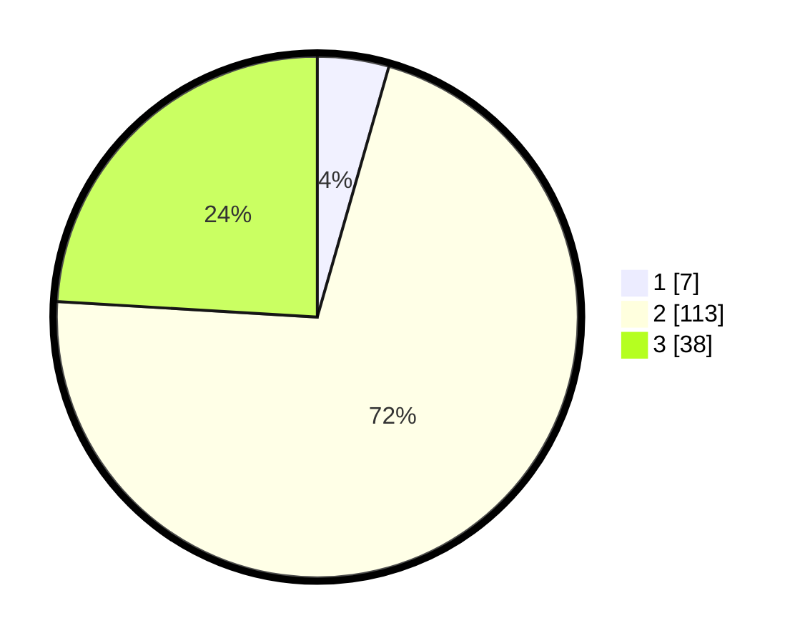

# Hasil

## Grafik

## Tabel

| No. | Nama Paslon    | Suara | Suara (raw) | Persentase |
|:--- |:-------------- | -----:| -----------:| ----------:|
| 1   | ANIES MUHAIMIN | 7     | [7][p-1]    | 4,43       |
| 2   | PRABOWO GIBRAN | 113   | [113][p-2]  | 71,52      |
| 3   | GANJAR MAHFUD  | 38    | [38][p-3]   | 24,05      |

[p-1]: https://github.com/gigit-pemilu/pemilu-2024-51-bali/blob/main/pilpres/hitung-suara/sub/51-bali/sub/71-kota-denpasar/sub/04-denpasar-utara/sub/2008-ubung-kaja/sub/047-tps/sub/paslon-1.txt
[p-2]: https://github.com/gigit-pemilu/pemilu-2024-51-bali/blob/main/pilpres/hitung-suara/sub/51-bali/sub/71-kota-denpasar/sub/04-denpasar-utara/sub/2008-ubung-kaja/sub/047-tps/sub/paslon-2.txt
[p-3]: https://github.com/gigit-pemilu/pemilu-2024-51-bali/blob/main/pilpres/hitung-suara/sub/51-bali/sub/71-kota-denpasar/sub/04-denpasar-utara/sub/2008-ubung-kaja/sub/047-tps/sub/paslon-3.txt

## Foto C Plano

https://sirekap-obj-formc.kpu.go.id/a626/pemilu/ppwp/51/71/04/20/08/5171042008047-20240214-214901--fdca2562-405e-42c4-89ae-af30384a65d8.jpg

https://sirekap-obj-formc.kpu.go.id/a626/pemilu/ppwp/51/71/04/20/08/5171042008047-20240214-214912--9de19532-7bb0-4a0d-aab6-5d3760712cee.jpg

https://sirekap-obj-formc.kpu.go.id/a626/pemilu/ppwp/51/71/04/20/08/5171042008047-20240214-214927--3d83ab90-5bb6-4d37-b9b3-743a393ca419.jpg

## Metadata

| Key        | Value               |
| ---------- | ------------------- |
| Time Stamp | 2024-02-17 18:30:00 |

