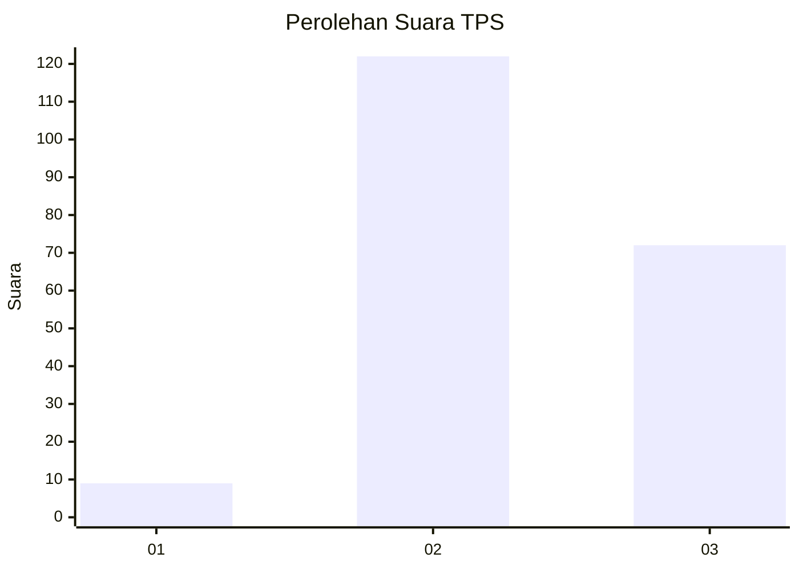
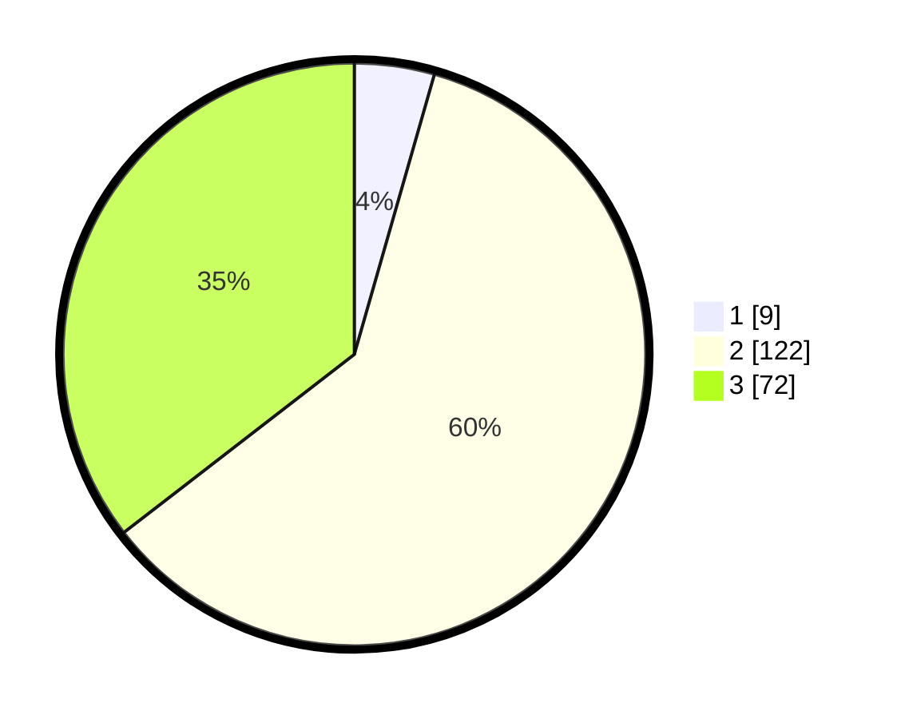

# Hasil

## Grafik

## Tabel

| No. | Nama Paslon    | Suara | Suara (raw) | Persentase |
|:--- |:-------------- | -----:| -----------:| ----------:|
| 1   | ANIES MUHAIMIN | 9     | [9][p-1]    | 4,43       |
| 2   | PRABOWO GIBRAN | 122   | [122][p-2]  | 60,10      |
| 3   | GANJAR MAHFUD  | 72    | [72][p-3]   | 35,47      |

[p-1]: https://github.com/gigit-pemilu/pemilu-2024-51-bali/blob/main/pilpres/hitung-suara/sub/51-bali/sub/71-kota-denpasar/sub/04-denpasar-utara/sub/2008-ubung-kaja/sub/050-tps/sub/paslon-1.txt
[p-2]: https://github.com/gigit-pemilu/pemilu-2024-51-bali/blob/main/pilpres/hitung-suara/sub/51-bali/sub/71-kota-denpasar/sub/04-denpasar-utara/sub/2008-ubung-kaja/sub/050-tps/sub/paslon-2.txt
[p-3]: https://github.com/gigit-pemilu/pemilu-2024-51-bali/blob/main/pilpres/hitung-suara/sub/51-bali/sub/71-kota-denpasar/sub/04-denpasar-utara/sub/2008-ubung-kaja/sub/050-tps/sub/paslon-3.txt

## Foto C Plano

https://sirekap-obj-formc.kpu.go.id/2c4d/pemilu/ppwp/51/71/04/20/08/5171042008050-20240214-201715--770f211b-bd7d-4000-b6f9-4cb8ba289f56.jpg

https://sirekap-obj-formc.kpu.go.id/2c4d/pemilu/ppwp/51/71/04/20/08/5171042008050-20240214-202221--d78a45bc-2d6f-40c0-99cf-1d25009f5623.jpg

https://sirekap-obj-formc.kpu.go.id/2c4d/pemilu/ppwp/51/71/04/20/08/5171042008050-20240214-185346--e01a9b0c-63aa-487a-9ea0-f627efed04bf.jpg

## Metadata

| Key        | Value               |
| ---------- | ------------------- |
| Time Stamp | 2024-02-24 22:31:28 |

