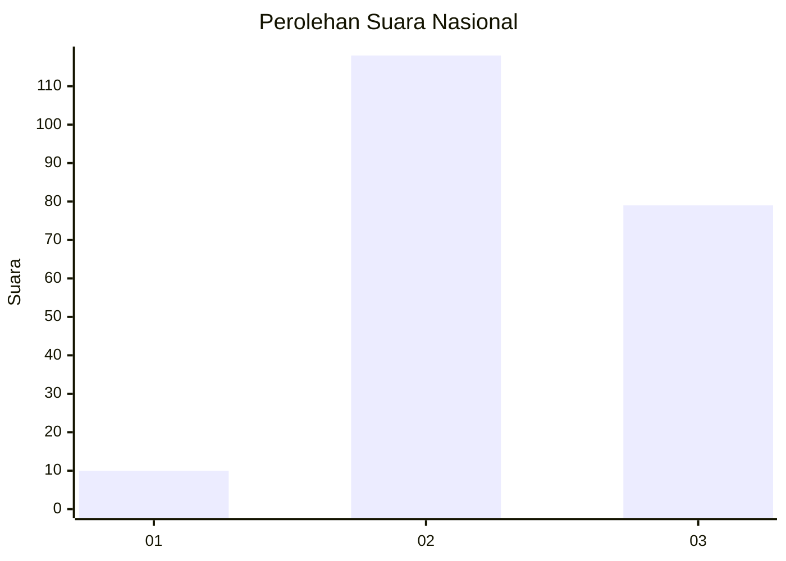
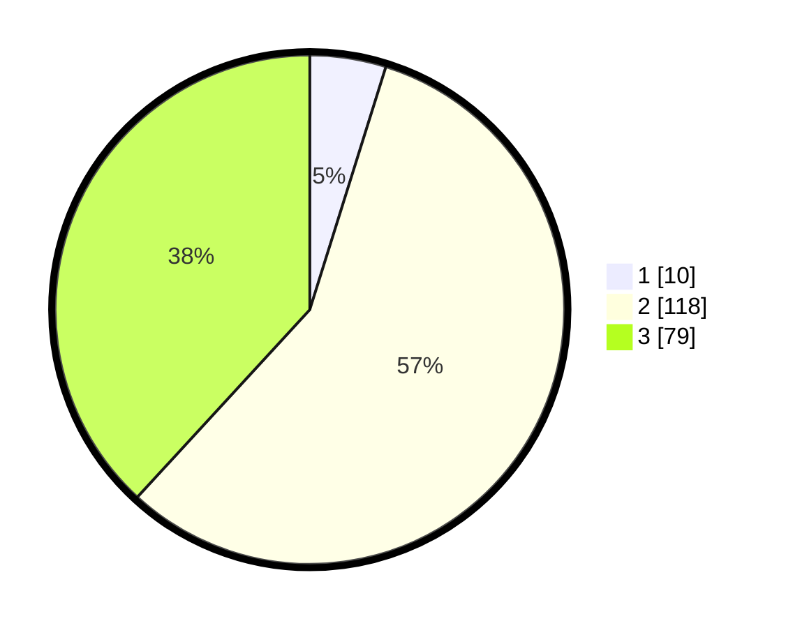

# Hasil

## Grafik

## Tabel

| No. | Nama Paslon    | Suara | Suara (raw) | Persentase |
|:--- |:-------------- | -----:| -----------:| ----------:|
| 1   | ANIES MUHAIMIN | 10    | [10][p-1]   | 4,83       |
| 2   | PRABOWO GIBRAN | 118   | [118][p-2]  | 57,00      |
| 3   | GANJAR MAHFUD  | 79    | [79][p-3]   | 38,16      |

[p-1]: https://github.com/gigit-pemilu/pemilu-2024/blob/main/pilpres/hitung-suara/sub/51-bali/sub/71-kota-denpasar/sub/04-denpasar-utara/sub/2008-ubung-kaja/sub/056-tps/sub/paslon-1.txt
[p-2]: https://github.com/gigit-pemilu/pemilu-2024/blob/main/pilpres/hitung-suara/sub/51-bali/sub/71-kota-denpasar/sub/04-denpasar-utara/sub/2008-ubung-kaja/sub/056-tps/sub/paslon-2.txt
[p-3]: https://github.com/gigit-pemilu/pemilu-2024/blob/main/pilpres/hitung-suara/sub/51-bali/sub/71-kota-denpasar/sub/04-denpasar-utara/sub/2008-ubung-kaja/sub/056-tps/sub/paslon-3.txt

## Foto C Plano

https://sirekap-obj-formc.kpu.go.id/b009/pemilu/ppwp/51/71/04/20/08/5171042008056-20240214-141907--db7782d2-5f9b-46ce-8e45-3bd181c9d40d.jpg

https://sirekap-obj-formc.kpu.go.id/b009/pemilu/ppwp/51/71/04/20/08/5171042008056-20240214-141734--d6d95664-ef7e-42e9-90d6-9316da7a8ad6.jpg

https://sirekap-obj-formc.kpu.go.id/b009/pemilu/ppwp/51/71/04/20/08/5171042008056-20240214-141816--77bae0bc-db56-41a5-98df-3260b4ebd1b4.jpg

## Metadata

| Key        | Value               |
| ---------- | ------------------- |
| Time Stamp | 2024-02-16 14:00:34 |

## DATA PEMILIH TETAP

Jumlah pemilih dalam DPT: **254**.
 * L: **122**.
 * P: **132**.

## DATA PENGGUNA HAK PILIH

Jumlah pengguna hak pilih dalam DPT: **197**.
 * L: **94**.
 * P: **103**.

Jumlah pengguna hak pilih dalam DPTb: **10**.
 * L: **6**.
 * P: **4**.

Jumlah pengguna hak pilih dalam DPK: **2**.
 * L: **1**.
 * P: **1**.

Jumlah pengguna hak pilih: **209**.
 * L: **101**.
 * P: **108**.

## JUMLAH SUARA SAH DAN TIDAK SAH

JUMLAH SELURUH SUARA SAH: **207**.

JUMLAH SUARA TIDAK SAH: **2**.

JUMLAH SELURUH SUARA SAH DAN SUARA TIDAK SAH: **209**.

