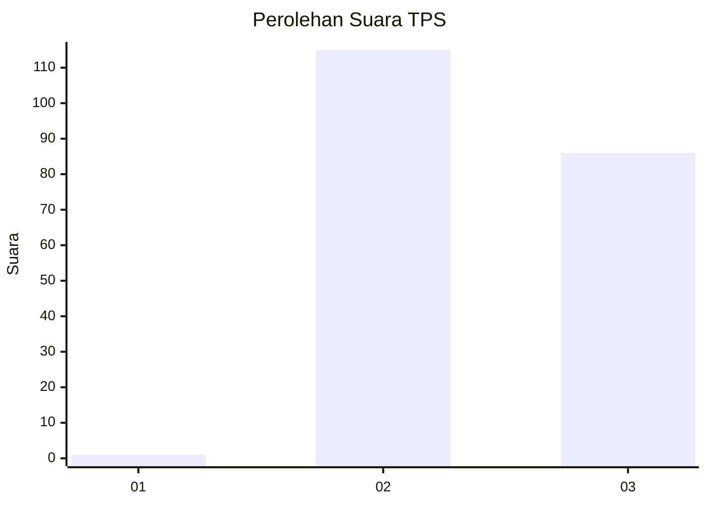
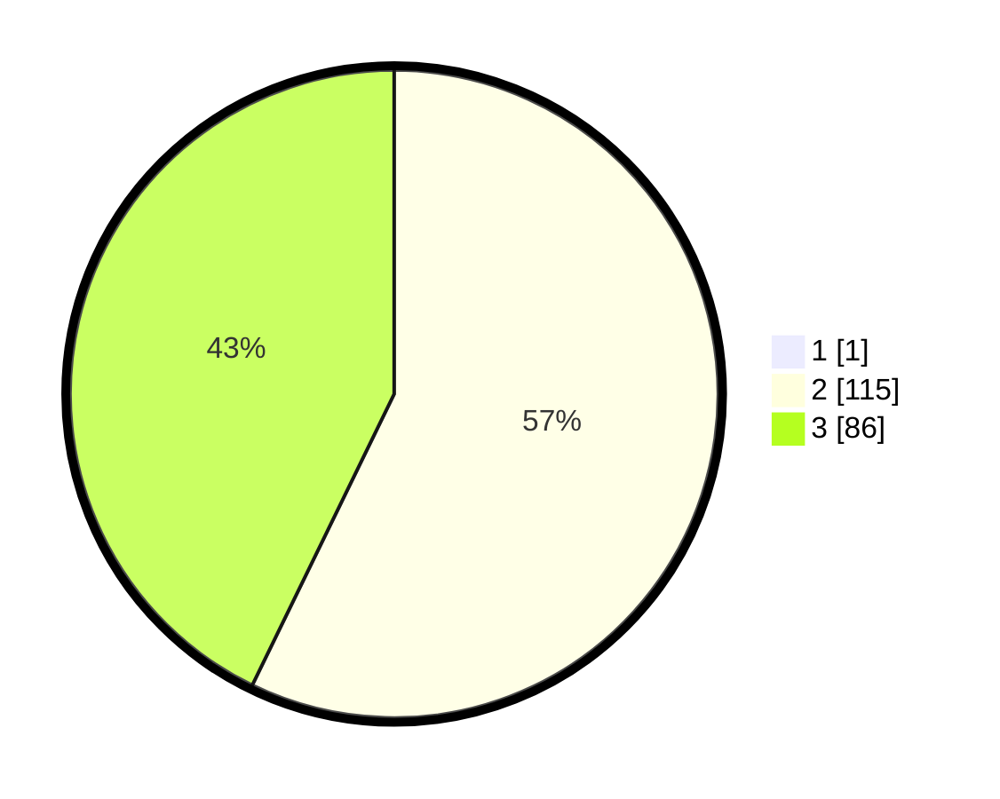

# Hasil

## Grafik

## Tabel

| No. | Nama Paslon    | Suara | Suara (raw) | Persentase |
|:--- |:-------------- | -----:| -----------:| ----------:|
| 1   | ANIES MUHAIMIN | 1     | [1][p-1]    | 0,50       |
| 2   | PRABOWO GIBRAN | 115   | [115][p-2]  | 56,93      |
| 3   | GANJAR MAHFUD  | 86    | [86][p-3]   | 42,57      |

[p-1]: https://github.com/gigit-pemilu/pemilu-2024-51-bali/blob/main/pilpres/hitung-suara/sub/51-bali/sub/71-kota-denpasar/sub/04-denpasar-utara/sub/2010-peguyangan-kaja/sub/004-tps/sub/paslon-1.txt
[p-2]: https://github.com/gigit-pemilu/pemilu-2024-51-bali/blob/main/pilpres/hitung-suara/sub/51-bali/sub/71-kota-denpasar/sub/04-denpasar-utara/sub/2010-peguyangan-kaja/sub/004-tps/sub/paslon-2.txt
[p-3]: https://github.com/gigit-pemilu/pemilu-2024-51-bali/blob/main/pilpres/hitung-suara/sub/51-bali/sub/71-kota-denpasar/sub/04-denpasar-utara/sub/2010-peguyangan-kaja/sub/004-tps/sub/paslon-3.txt

## Foto C Plano

https://sirekap-obj-formc.kpu.go.id/405e/pemilu/ppwp/51/71/04/20/10/5171042010004-20240214-192926--b31ca92b-01f6-4c1b-8461-42338a229dcb.jpg

https://sirekap-obj-formc.kpu.go.id/405e/pemilu/ppwp/51/71/04/20/10/5171042010004-20240214-192933--38001bf6-8b66-4185-b663-daebb5f33ffe.jpg

https://sirekap-obj-formc.kpu.go.id/405e/pemilu/ppwp/51/71/04/20/10/5171042010004-20240214-222420--956a2fe0-fa56-47b0-8b3a-33b727c0c8f6.jpg

## Metadata

| Key        | Value               |
| ---------- | ------------------- |
| Time Stamp | 2024-02-24 22:31:28 |

