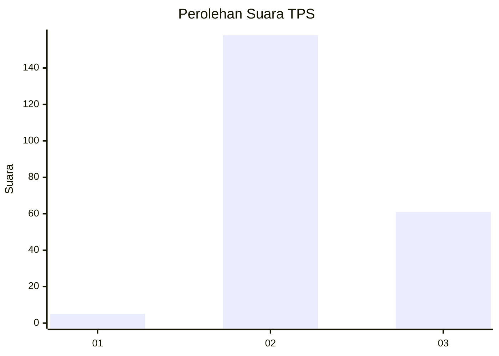
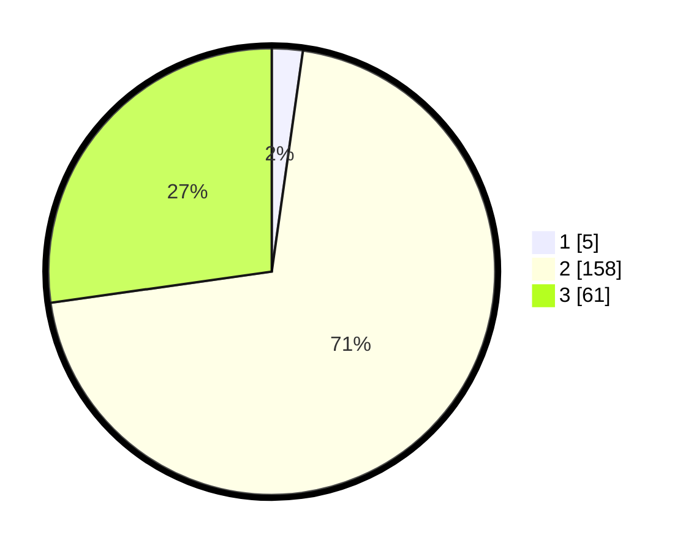

# Hasil

## Grafik

## Tabel

| No. | Nama Paslon    | Suara | Suara (raw) | Persentase |
|:--- |:-------------- | -----:| -----------:| ----------:|
| 1   | ANIES MUHAIMIN | 5     | [5][p-1]    | 2,23       |
| 2   | PRABOWO GIBRAN | 158   | [158][p-2]  | 70,54      |
| 3   | GANJAR MAHFUD  | 61    | [61][p-3]   | 27,23      |

[p-1]: https://github.com/gigit-pemilu/pemilu-2024-51-bali/blob/main/pilpres/hitung-suara/sub/51-bali/sub/71-kota-denpasar/sub/04-denpasar-utara/sub/2010-peguyangan-kaja/sub/008-tps/sub/paslon-1.txt
[p-2]: https://github.com/gigit-pemilu/pemilu-2024-51-bali/blob/main/pilpres/hitung-suara/sub/51-bali/sub/71-kota-denpasar/sub/04-denpasar-utara/sub/2010-peguyangan-kaja/sub/008-tps/sub/paslon-2.txt
[p-3]: https://github.com/gigit-pemilu/pemilu-2024-51-bali/blob/main/pilpres/hitung-suara/sub/51-bali/sub/71-kota-denpasar/sub/04-denpasar-utara/sub/2010-peguyangan-kaja/sub/008-tps/sub/paslon-3.txt

## Foto C Plano

https://sirekap-obj-formc.kpu.go.id/d8bf/pemilu/ppwp/51/71/04/20/10/5171042010008-20240214-220826--5d81c26d-bb98-483a-a9f9-edfcf8ffb9a1.jpg

https://sirekap-obj-formc.kpu.go.id/d8bf/pemilu/ppwp/51/71/04/20/10/5171042010008-20240214-220842--40d97f17-3164-4001-a2d4-3da9712f932d.jpg

https://sirekap-obj-formc.kpu.go.id/d8bf/pemilu/ppwp/51/71/04/20/10/5171042010008-20240214-220847--d7c4717e-966d-4cdd-80f8-57c7ad9ed803.jpg

## Metadata

| Key        | Value               |
| ---------- | ------------------- |
| Time Stamp | 2024-02-25 15:00:00 |

