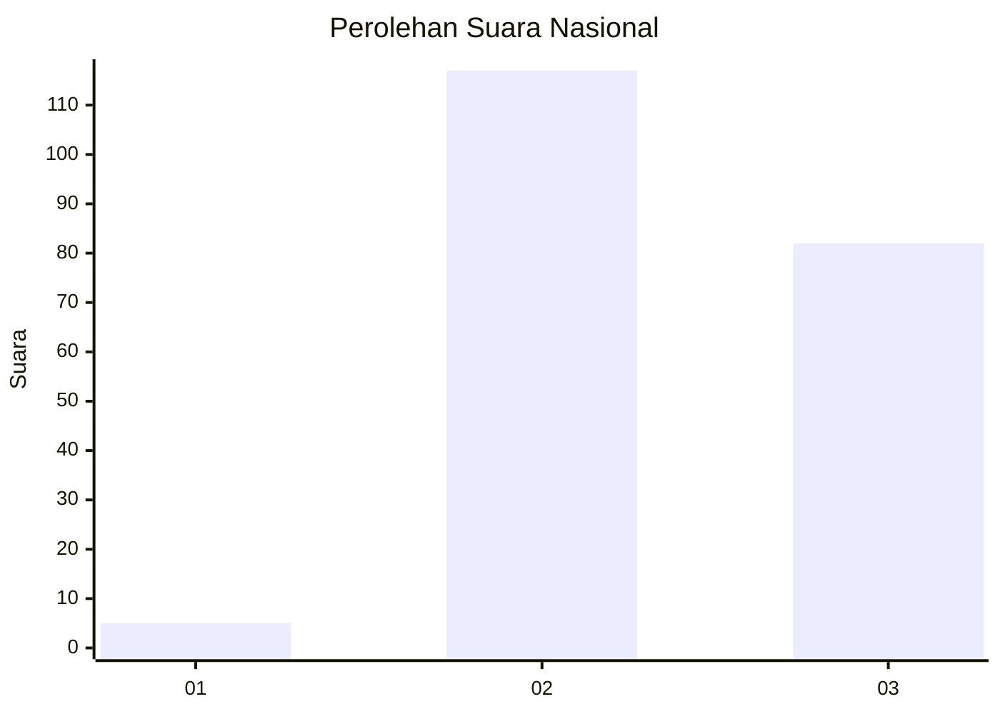
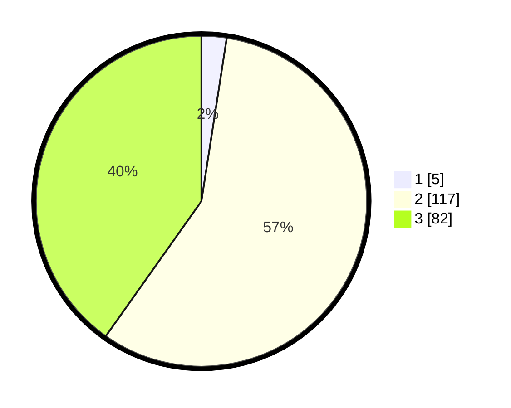

# Hasil

## Grafik

## Tabel

| No. | Nama Paslon    | Suara | Suara (raw) | Persentase |
|:--- |:-------------- | -----:| -----------:| ----------:|
| 1   | ANIES MUHAIMIN | 5     | [5][p-1]    | 2,45       |
| 2   | PRABOWO GIBRAN | 117   | [117][p-2]  | 57,35      |
| 3   | GANJAR MAHFUD  | 82    | [82][p-3]   | 40,20      |

[p-1]: https://github.com/gigit-pemilu/pemilu-2024/blob/main/pilpres/hitung-suara/sub/51-bali/sub/71-kota-denpasar/sub/04-denpasar-utara/sub/2010-peguyangan-kaja/sub/018-tps/sub/paslon-1.txt
[p-2]: https://github.com/gigit-pemilu/pemilu-2024/blob/main/pilpres/hitung-suara/sub/51-bali/sub/71-kota-denpasar/sub/04-denpasar-utara/sub/2010-peguyangan-kaja/sub/018-tps/sub/paslon-2.txt
[p-3]: https://github.com/gigit-pemilu/pemilu-2024/blob/main/pilpres/hitung-suara/sub/51-bali/sub/71-kota-denpasar/sub/04-denpasar-utara/sub/2010-peguyangan-kaja/sub/018-tps/sub/paslon-3.txt

## Foto C Plano

https://sirekap-obj-formc.kpu.go.id/3acb/pemilu/ppwp/51/71/04/20/10/5171042010018-20240214-214725--ae06100d-8299-45ad-8437-c727576e5e1a.jpg

https://sirekap-obj-formc.kpu.go.id/3acb/pemilu/ppwp/51/71/04/20/10/5171042010018-20240214-214911--30533eb6-e7af-4b05-9efc-4e318971e505.jpg

https://sirekap-obj-formc.kpu.go.id/3acb/pemilu/ppwp/51/71/04/20/10/5171042010018-20240214-215427--a0a3f8ad-ee00-4f5a-bdc7-806cf1b70337.jpg

## Metadata

| Key        | Value               |
| ---------- | ------------------- |
| Time Stamp | 2024-02-24 22:31:28 |

