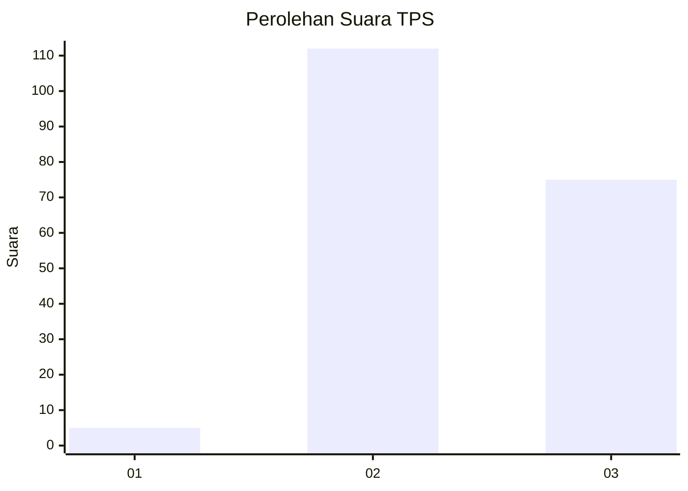
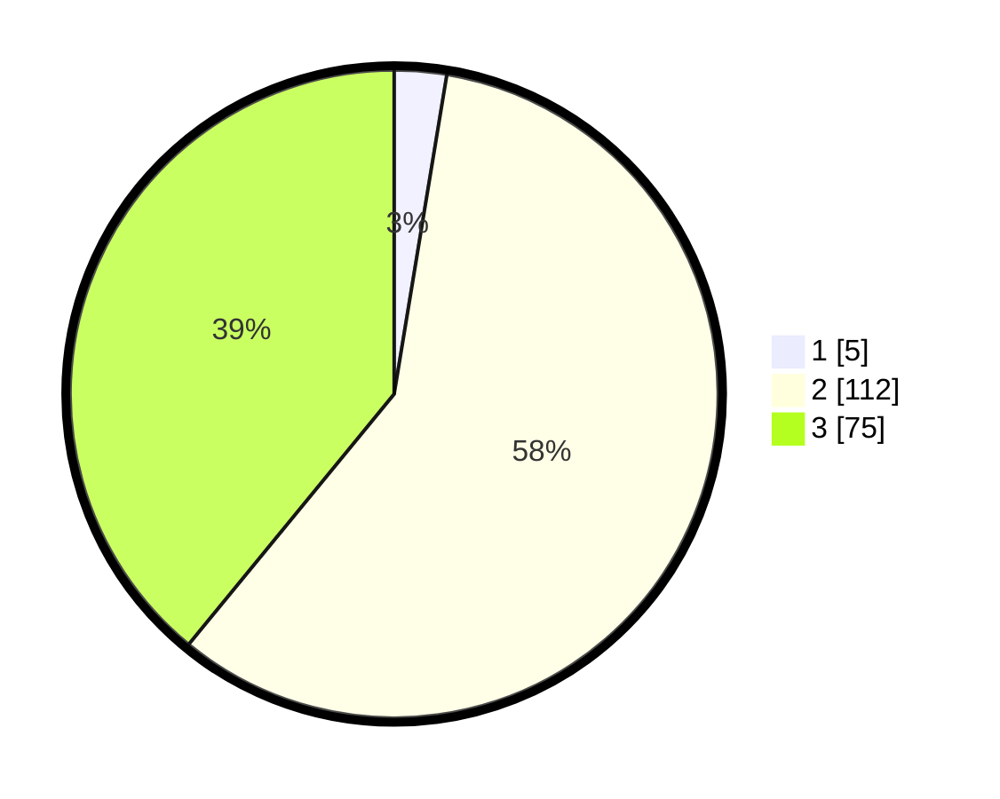

# Hasil

## Grafik

## Tabel

| No. | Nama Paslon    | Suara | Suara (raw) | Persentase |
|:--- |:-------------- | -----:| -----------:| ----------:|
| 1   | ANIES MUHAIMIN | 5     | [5][p-1]    | 2,60       |
| 2   | PRABOWO GIBRAN | 112   | [112][p-2]  | 58,33      |
| 3   | GANJAR MAHFUD  | 75    | [75][p-3]   | 39,06      |

[p-1]: https://github.com/gigit-pemilu/pemilu-2024-51-bali/blob/main/pilpres/hitung-suara/sub/51-bali/sub/71-kota-denpasar/sub/04-denpasar-utara/sub/2010-peguyangan-kaja/sub/019-tps/sub/paslon-1.txt
[p-2]: https://github.com/gigit-pemilu/pemilu-2024-51-bali/blob/main/pilpres/hitung-suara/sub/51-bali/sub/71-kota-denpasar/sub/04-denpasar-utara/sub/2010-peguyangan-kaja/sub/019-tps/sub/paslon-2.txt
[p-3]: https://github.com/gigit-pemilu/pemilu-2024-51-bali/blob/main/pilpres/hitung-suara/sub/51-bali/sub/71-kota-denpasar/sub/04-denpasar-utara/sub/2010-peguyangan-kaja/sub/019-tps/sub/paslon-3.txt

## Foto C Plano

https://sirekap-obj-formc.kpu.go.id/0fee/pemilu/ppwp/51/71/04/20/10/5171042010019-20240214-224215--175a40b1-5a8c-4cf9-af5e-5ccfda19401b.jpg

https://sirekap-obj-formc.kpu.go.id/0fee/pemilu/ppwp/51/71/04/20/10/5171042010019-20240214-201338--700e4733-510a-46f7-9eab-3043c538e0f6.jpg

https://sirekap-obj-formc.kpu.go.id/0fee/pemilu/ppwp/51/71/04/20/10/5171042010019-20240214-201535--9a46fb04-94b6-4384-bfea-650a996c5fea.jpg

## Metadata

| Key        | Value               |
| ---------- | ------------------- |
| Time Stamp | 2024-02-24 22:31:28 |

