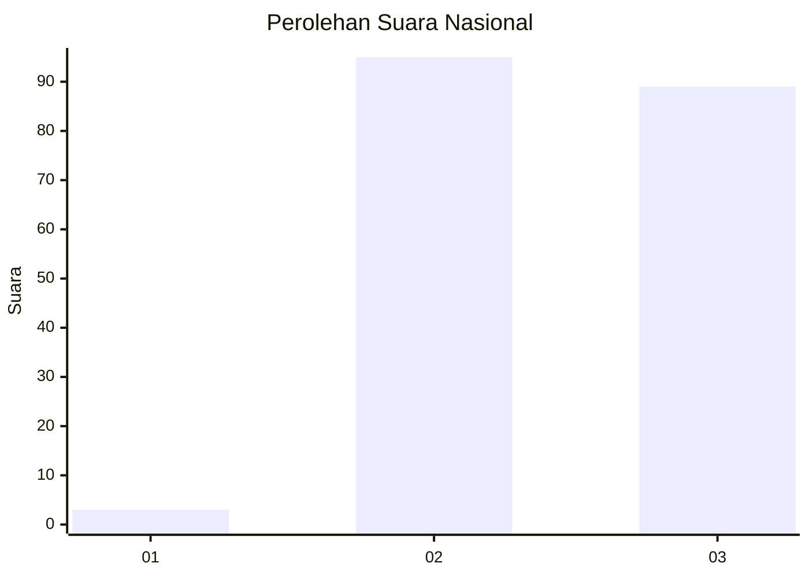
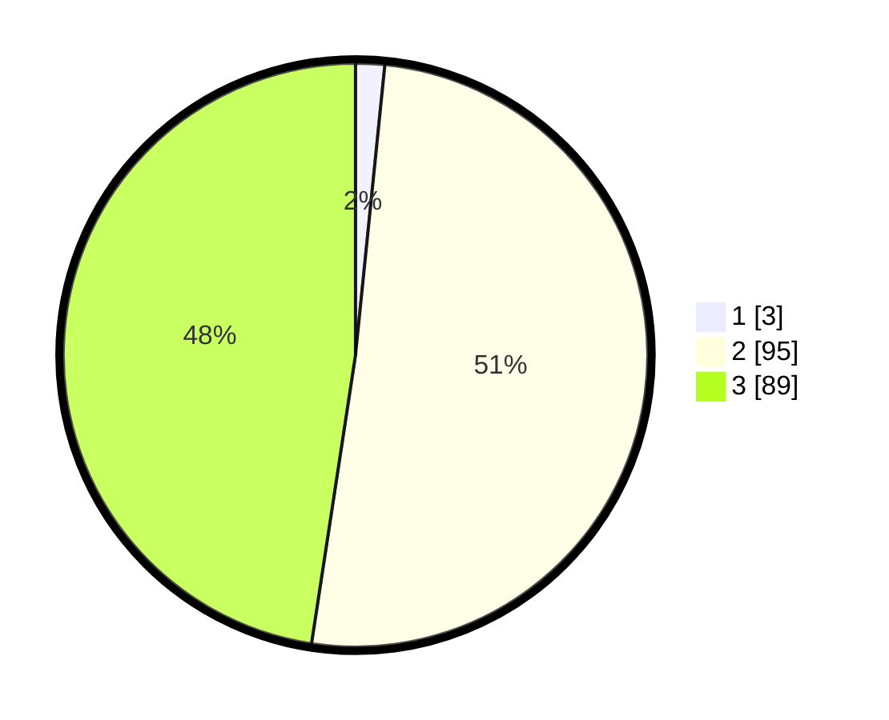

# Hasil

## Grafik

## Tabel

| No. | Nama Paslon    | Suara | Suara (raw) | Persentase |
|:--- |:-------------- | -----:| -----------:| ----------:|
| 1   | ANIES MUHAIMIN | 3     | [3][p-1]    | 1,60       |
| 2   | PRABOWO GIBRAN | 95    | [95][p-2]   | 50,80      |
| 3   | GANJAR MAHFUD  | 89    | [89][p-3]   | 47,59      |

[p-1]: https://github.com/gigit-pemilu/pemilu-2024/blob/main/pilpres/hitung-suara/sub/51-bali/sub/71-kota-denpasar/sub/04-denpasar-utara/sub/2010-peguyangan-kaja/sub/027-tps/sub/paslon-1.txt
[p-2]: https://github.com/gigit-pemilu/pemilu-2024/blob/main/pilpres/hitung-suara/sub/51-bali/sub/71-kota-denpasar/sub/04-denpasar-utara/sub/2010-peguyangan-kaja/sub/027-tps/sub/paslon-2.txt
[p-3]: https://github.com/gigit-pemilu/pemilu-2024/blob/main/pilpres/hitung-suara/sub/51-bali/sub/71-kota-denpasar/sub/04-denpasar-utara/sub/2010-peguyangan-kaja/sub/027-tps/sub/paslon-3.txt

## Foto C Plano

https://sirekap-obj-formc.kpu.go.id/ea8c/pemilu/ppwp/51/71/04/20/10/5171042010027-20240214-195015--f7abe040-2fd1-47e2-94ce-a64509c5809e.jpg

https://sirekap-obj-formc.kpu.go.id/ea8c/pemilu/ppwp/51/71/04/20/10/5171042010027-20240214-195046--7e1fd356-0827-43e0-9740-0a55ca65146f.jpg

https://sirekap-obj-formc.kpu.go.id/ea8c/pemilu/ppwp/51/71/04/20/10/5171042010027-20240214-195131--6457e2cf-82d3-4bf0-bae2-03c1cc361410.jpg

## Metadata

| Key        | Value               |
| ---------- | ------------------- |
| Time Stamp | 2024-02-24 22:31:28 |

