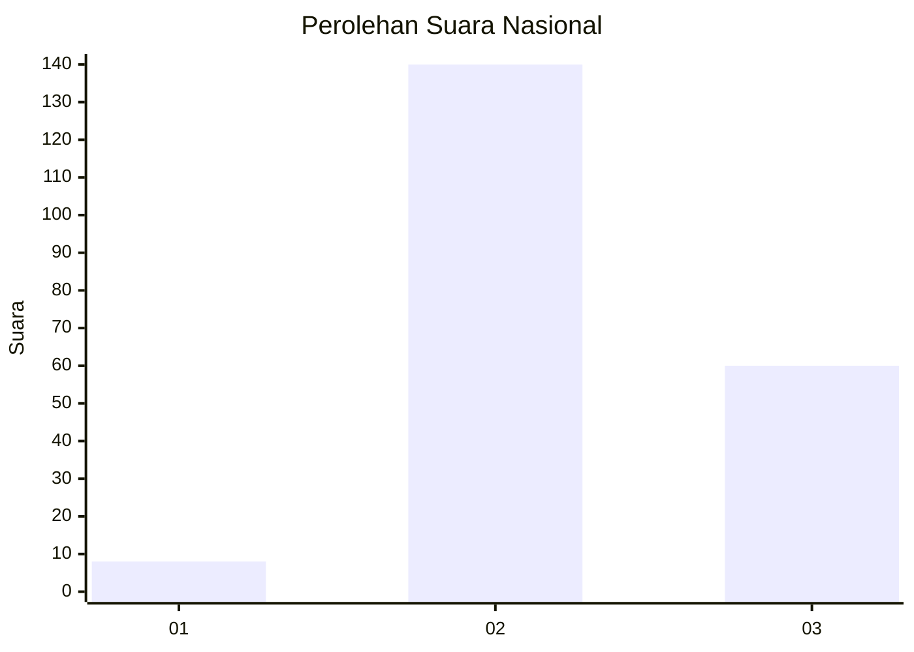

# Hasil

## Grafik

## Tabel

| No. | Nama Paslon    | Suara | Suara (raw) | Persentase |
|:--- |:-------------- | -----:| -----------:| ----------:|
| 1   | ANIES MUHAIMIN | 8     | [8][p-1]    | 3,85       |
| 2   | PRABOWO GIBRAN | 140   | [140][p-2]  | 67,31      |
| 3   | GANJAR MAHFUD  | 60    | [60][p-3]   | 28,85      |

[p-1]: https://github.com/gigit-pemilu/pemilu-2024/blob/main/pilpres/hitung-suara/sub/51-bali/sub/71-kota-denpasar/sub/04-denpasar-utara/sub/2011-peguyangan-kangin/sub/005-tps/sub/paslon-1.txt
[p-2]: https://github.com/gigit-pemilu/pemilu-2024/blob/main/pilpres/hitung-suara/sub/51-bali/sub/71-kota-denpasar/sub/04-denpasar-utara/sub/2011-peguyangan-kangin/sub/005-tps/sub/paslon-2.txt
[p-3]: https://github.com/gigit-pemilu/pemilu-2024/blob/main/pilpres/hitung-suara/sub/51-bali/sub/71-kota-denpasar/sub/04-denpasar-utara/sub/2011-peguyangan-kangin/sub/005-tps/sub/paslon-3.txt

## Foto C Plano

https://sirekap-obj-formc.kpu.go.id/b5aa/pemilu/ppwp/51/71/04/20/11/5171042011005-20240215-002129--6ab736ce-fe77-40ec-a5ee-d41efa42ab9f.jpg

https://sirekap-obj-formc.kpu.go.id/b5aa/pemilu/ppwp/51/71/04/20/11/5171042011005-20240215-002033--d0b9df20-2c5e-4845-84f3-3caf4cebdea1.jpg

https://sirekap-obj-formc.kpu.go.id/b5aa/pemilu/ppwp/51/71/04/20/11/5171042011005-20240215-001938--e1ae6b02-b1dc-46fd-b060-9c319c6ee028.jpg

## Metadata

| Key        | Value               |
| ---------- | ------------------- |
| Time Stamp | 2024-02-21 01:00:00 |

